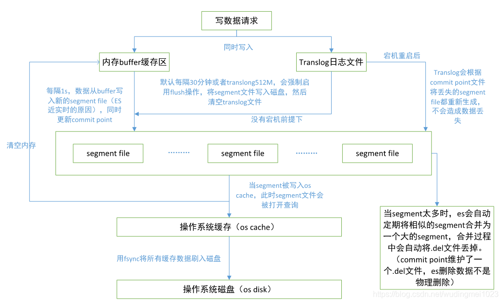
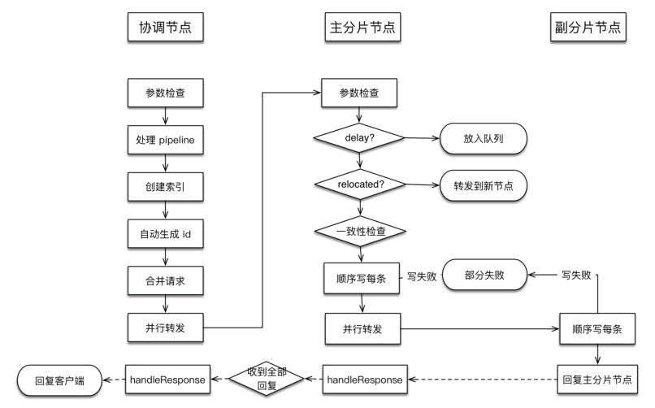
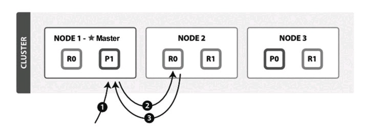
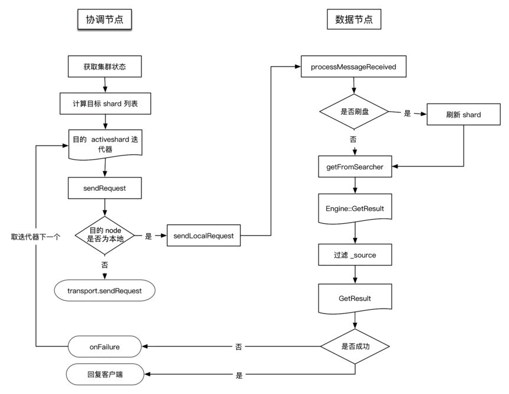
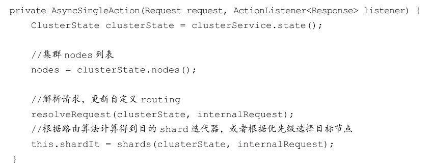
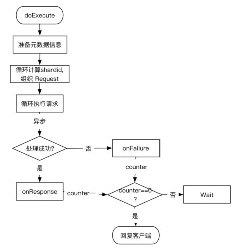
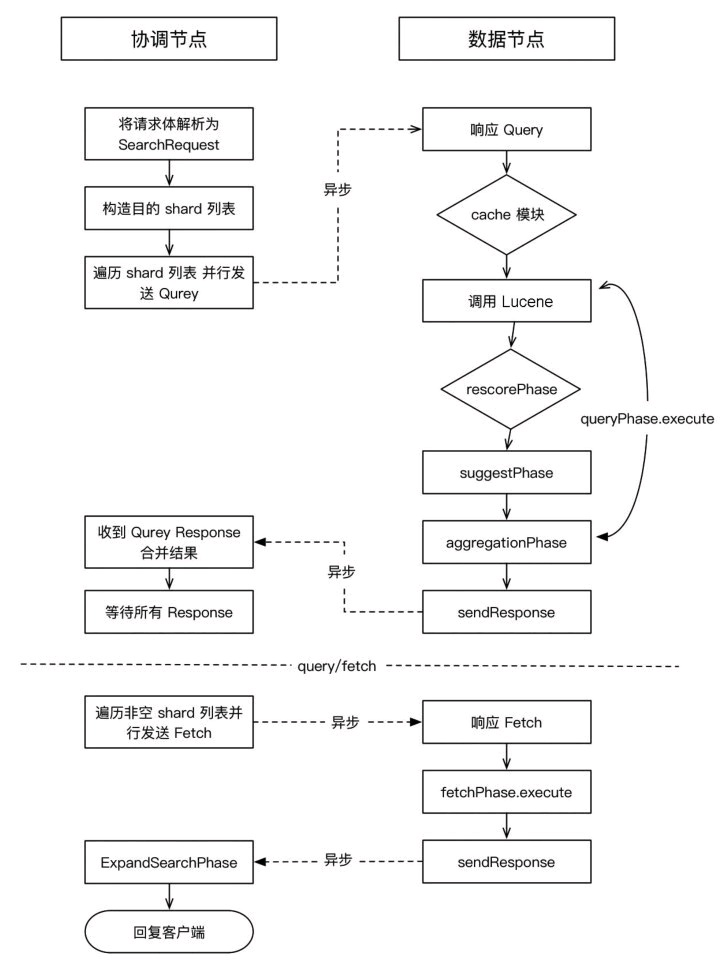

# EntryTask:分析es从客户端请求发起到结果返回的整个调用链路（读与写），并对关键函数进行分析说明，最终输出报告（报告需要有详细的请求流转路径，关键函数标注解释），从而为后续的排查一些复杂问题提供支持。

## 1. 写流程分析

### 1.1 写数据的过程



流程中各个组件整理：

- segment file：

存储倒排索引的文件，每个segment本质上就是一个倒排索引。每秒index buffer都会写入一个segment文件，这个过程也叫reflush。当文件过多时es会自动进行segment merge（合并文件），合并时会同时将已经标注(.del文件中的记录)删除的文档物理删除。多个segment汇总在一起称为Lucene Index，也就是一个shard。

- commit point：

记录当前所有可用的segment，每个commit point都会维护一个.del文件（es删除数据本质是不属于物理除），当es做删改操作时首先会在.del文件中声明某个document已经被删除，文件内记录了在某个segment内某个文档已经被删除，当查询请求过来时在segment中被删除的文件是能够查出来的，但是当返回结果时会根据commitpoint维护的那个.del文件把已经删除的文档过滤掉；

- translog日志文件:  默认是512mb，或30分钟时就会清空translog，执行flush。

为了防止elasticsearch宕机造成数据丢失保证可靠存储，es会将每次写入数据同时写到translog日志中。清空translog就是flush操作，同时伴随着segment提交(写入磁盘)。flush之后，这段translog的使命就完成了，因为segment已经写入磁盘，就算故障，也可以从segment文件恢复。

### 1.2 写入请求源码分析

写入方式：ES提供两种写入方式：index，逐条写入；Bulk，批量写入。对于这两种方式，ES都会转化成Bulk写入。

请求入口：RestController#dispatchRequest将请求进行转发

```java
	public class RestController implements HttpServerTransport.Dispatcher {
    //....
    @Override
    /**
     * @RestRequest 请求相关的信息，包含请求参数、请求头、消费参数、请求原生路径、url
     * @RestChannel 信道用于构造基于输出的字节和构造器以及发送响应，接口
     * @threadContext 与线程相关的一些参数、如一些头部信息的保存、关键对象的上下文设置
     */
    public void dispatchRequest(RestRequest request, RestChannel channel, ThreadContext threadContext) {
        //设置线程上下文信息，就是加了两个字段"X-elastic-product"和"elasticSearch"两个信息
        //ThreadContext#addResponseHeader调用这个方法就是在threadLocal里设置ThreadContextStruct的信息，一遍上下文获取
        threadContext.addResponseHeader(ELASTIC_PRODUCT_HTTP_HEADER, ELASTIC_PRODUCT_HTTP_HEADER_VALUE);
        try {
            //找出所有可能的handlers，然后分发这些请求
            tryAllHandlers(request, channel, threadContext);
        } catch (Exception e) {
            try {
                //当没有找到相应的handlers时，返回错误信息
                channel.sendResponse(new BytesRestResponse(channel, e));
            } catch (Exception inner) {
            }
        }
    }
    //...
  }
```

RestController#tryAllHandlers:根据请求的请求方法和RestApi的版本找到相应的handler并且将请求转发到相应的Handler上处理

```java
private void tryAllHandlers(final RestRequest request, final RestChannel channel, final ThreadContext threadContext) throws Exception {
    try {
              //遍历请求的头部信息，复制头部信息并且设置threadContext响应信息
              copyRestHeaders(request, threadContext);
              //验证请求信息
              validateErrorTrace(request, channel);
          } catch (IllegalArgumentException e) {
              //验证失败时，会捕获抛出的异常，通过channel发送相应的信息
              channel.sendResponse(BytesRestResponse.createSimpleErrorResponse(channel, BAD_REQUEST, e.getMessage()));
              return;
    }
  //....获取请求方法、原生路径、url等
   					Iterator<MethodHandlers> allHandlers = getAllHandlers(request.params(), rawPath);
            while (allHandlers.hasNext()) { //循环迭代器遍历处理器
                final RestHandler handler;
                // 方法处理器
                final MethodHandlers handlers = allHandlers.next();
              	//设置对应的处理器，判空部分省略
              	handler = handlers.getHandler(requestMethod, restApiVersion);
              	//将请求发送到正确的处理器进行处理
              	dispatchRequest(request, channel, handler, threadContext);
            }
  //...处理BadRequest语句
}
```

RestController#dispatchRequest：方法重载，多了handler参数，对请求进一步验证且处理

```java 
private void dispatchRequest(RestRequest request, RestChannel channel, RestHandler handler,
                             ThreadContext threadContext)
  throws Exception {
  				//... 先是内容长度验证、XContentType验证JSON和SMILE、验证Handler是否可以跳闸断路器、
  				//channel设置相应的信息、设置handler要支持ensureSafeBuffers
					//handler调用处理请求的方法、设置threadContext相关头部信息,client是节点信息的客服端
					handler.handleRequest(request, responseChannel, client);	
}
```

那么handler是怎么处理请求的，这里的RestHandler是一个接口，其实RestController在初始化时会注册每种处理器。RestController#registerHandler提前把handler注册到对应http请求方法（GET、PUT、POST、DELETE等）的handlers列表。

```java
//RestBulkAction (extends BaseRestHandler implements RestHandler)
public class RestBulkAction extends BaseRestHandler {
  	//.....
  	@Override
    public List<Route> routes() {
        return List.of(
            new Route(POST, "/_bulk"),
            new Route(PUT, "/_bulk"),
            new Route(POST, "/{index}/_bulk"),
            new Route(PUT, "/{index}/_bulk"),
            Route.builder(POST, "/{index}/{type}/_bulk")
                .deprecated(TYPES_DEPRECATION_MESSAGE, RestApiVersion.V_7)
                .build(),
            Route.builder(PUT, "/{index}/{type}/_bulk")
                .deprecated(TYPES_DEPRECATION_MESSAGE, RestApiVersion.V_7)
                .build());
    }
  //....
}
//这里是Index的执行
public class RestIndexAction extends BaseRestHandler {
      @Override
    public List<Route> routes() {
        return List.of(
            new Route(POST, "/{index}/_doc/{id}"),
            new Route(PUT, "/{index}/_doc/{id}"),
            Route.builder(POST, "/{index}/{type}/{id}")
                .deprecated(TYPES_DEPRECATION_MESSAGE, RestApiVersion.V_7)
                .build(),
            Route.builder(PUT, "/{index}/{type}/{id}")
                .deprecated(TYPES_DEPRECATION_MESSAGE, RestApiVersion.V_7)
                .build());
    }
      @Override
    public RestChannelConsumer prepareRequest(final RestRequest request, final NodeClient client) throws IOException {
        IndexRequest indexRequest = new IndexRequest(request.param("index"));
				//... indexRequest参数的一些列填充
        return channel ->
                client.index(indexRequest, new RestStatusToXContentListener<>(channel, r -> r.getLocation(indexRequest.routing())));
    }
}
//抽象类BaseRestHandler做了handleRequest的方法实现
public abstract class BaseRestHandler implements RestHandler {
  //...
   @Override
    public final void handleRequest(RestRequest request, RestChannel channel, NodeClient client) throws Exception {
        // prepare the request for execution; has the side effect of touching the request parameters
        final RestChannelConsumer action = prepareRequest(request, client);

        // validate unconsumed params, but we must exclude params used to format the response
        // use a sorted set so the unconsumed parameters appear in a reliable sorted order
        final SortedSet<String> unconsumedParams = request.unconsumedParams()
            .stream()
            .filter(p -> responseParams(request.getRestApiVersion()).contains(p) == false)
            .collect(Collectors.toCollection(TreeSet::new));

        // validate the non-response params
      	//。。。验证参数部分砍掉了
        //执行任务
        action.accept(channel);
    }
  //....
}
//RestController中对handler进行注册
    public void registerHandler(final RestHandler handler) {//对Hander的路由方式进行注册handler上
        handler.routes().forEach(route -> registerHandler(route, handler));
    }
//将注册好的MethodHandler放入 PathTrie<MethodHandlers> ，更新或者添加
```

到这里Index和Bulk的请求流程就是一致的了，接下来就只分析Bulk。RestBulkAction会将RestRequest解析并转化为BulkRequest，然后对BulkRequest做处理。

```java
 @Override
    public RestChannelConsumer prepareRequest(final RestRequest request, final NodeClient client) throws IOException {
      	//...将RestRequest转化为BulkRequest
       BulkRequest bulkRequest = Requests.bulkRequest();
      //...一些列操作生成BulkRequset
      //处理bulkRequest请求
      return channel -> client.bulk(bulkRequest, new RestStatusToXContentListener<>(channel));      
    }
```

NodeClient在处理BulkRequest请求时，会将请求的action转化为对应Transport层的action，然后再由Transport层的action来处理BulkRequest。NodeClient extends（ AbstractClient implements Client）。执行bulk方法时，执行的是AbstractClient的bulk方法。而doExecute是NodeClient实现的方法

```java
public abstract class AbstractClient implements Client {
  	@Override
    public void bulk(final BulkRequest request, final ActionListener<BulkResponse> listener) {
        execute(BulkAction.INSTANCE, request, listener);
    }
  	@Override
    public void index(final IndexRequest request, final ActionListener<IndexResponse> listener) {
        execute(IndexAction.INSTANCE, request, listener);
    }
  	@Override
    public final <Request extends ActionRequest, Response extends ActionResponse> void execute(
        ActionType<Response> action, Request request, ActionListener<Response> listener) {
        try {
            doExecute(action, request, listener);
        } catch (Exception e) {
        }
    }
}
```

NodeClient#doExecute。NodeClient在处理BulkRequest请求时，会将请求的action转化为对应Transport层的action，然后再由Transport层的action来处理BulkRequest，

```java
    //这里是NodeClinet处理请求action
		@Override
    public <Request extends ActionRequest, Response extends ActionResponse>
    void doExecute(ActionType<Response> action, Request request, ActionListener<Response> listener) {
        // Discard the task because the Client interface doesn't use it.
            executeLocally(action, request, listener);
    }
	//将请求action转化为Transport层的action
	private <    Request extends ActionRequest,
                Response extends ActionResponse
            > TransportAction<Request, Response> transportAction(ActionType<Response> action) {
        //...actions是个action到transportAction的Map，这个映射关系是在节点启动时初始化的
        TransportAction<Request, Response> transportAction = actions.get(action);
        return transportAction;
    }
		//将请求action转化为Transport层的action进行注册并执行。
		public <    Request extends ActionRequest,
                Response extends ActionResponse
            > Task executeLocally(ActionType<Response> action, Request request, ActionListener<Response> listener) {
        return taskManager.registerAndExecute("transport", transportAction(action), request, localConnection,
                (t, r) -> {//BiConsumer<Task, Response> onResponse。成功时返回的响应
                    try {
                        listener.onResponse(r);
                    } catch (Exception e) {
                        assert false : new AssertionError("callback must handle its own exceptions", e);
                        throw e;
                    }
                }, (t, e) -> {//BiConsumer<Task, Exception> onFailure。失败时返回的响应
                    try {
                        listener.onFailure(e);
                    } catch (Exception ex) {
                        ex.addSuppressed(e);
                        assert false : new AssertionError("callback must handle its own exceptions", ex);
                        throw ex;
                    }
                });
    }

	//TaskManager#registerAndExecute
	public <Request extends ActionRequest, Response extends ActionResponse>
    Task registerAndExecute(String type, TransportAction<Request, Response> action, Request request, Transport.Connection localConnection,
                            BiConsumer<Task, Response> onResponse, BiConsumer<Task, Exception> onFailure) {
    //....对Request和Task进行设置注册
    action.execute(task, request, new ActionListener<Response>() {
            @Override
            public void onResponse(Response response) {
                try {
                    Releasables.close(unregisterChildNode, () -> unregister(task));
                } finally {
                    onResponse.accept(task, response);
                }
            }

            @Override
            public void onFailure(Exception e) {
                try {
                    Releasables.close(unregisterChildNode, () -> unregister(task));
                } finally {
                    onFailure.accept(task, e);
                }
            }
        });
    	return task;
  }
```

然后进入TransportAction，TransportAction#execute(Request request, ActionListener listener) ->TransportAction$RequestFilterChain#proceed(Task task, String actionName, Request request, ActionListener\<Response> listener)。TransportAction会调用一个请求过滤链来处理请求，如果相关的插件定义了对该action的过滤处理，则先会执行插件的处理逻辑，然后再进入TransportAction的处理逻辑，过滤链的处理逻辑如下：

```java
  			@Override
        public void proceed(Task task, String actionName, Request request, ActionListener<Response> listener) {
            int i = index.getAndIncrement();
            try {
                if (i < this.action.filters.length) {
                    this.action.filters[i].apply(task, actionName, request, listener, this);
                } else if (i == this.action.filters.length) {
                  //这里TransportAction#doExecute是一个抽象方法。
                    this.action.doExecute(task, request, listener);
                } else {//处理错误
                }
            } catch(Exception e) {
							//...
            }
        }
```

对于index或者Bulk请求，这里的TransportAction对应的具体对象是TransportBulkAction的实例。

### 1.3 写入数据流程



#### 1.3.1 参数检查&处理pipeline

由于TransportIndexAction已经被废除了，我就分析Transport BulkAction的部分。

```java
@Deprecated
public class TransportIndexAction extends TransportSingleItemBulkWriteAction<IndexRequest, IndexResponse> {
  //Deprecated use TransportBulkAction with a single item instead 
  //可以看到用带有单个项的TransportBulkAction代替
}
```

从1.2请求分析，可以知道入口就是TransportBulkAction#doExecute(Task task, BulkRequest bulkRequest, ActionListener listener)。首先是处理pipeline，取决于当前节点是否为Ingest节点。

```java
    @Override
    protected void doExecute(Task task, BulkRequest bulkRequest, ActionListener<BulkResponse> listener) {
				//...一些列的操作得到executorName、releasingListener
        try {
            doInternalExecute(task, bulkRequest, executorName, releasingListener);
        } catch (Exception e) {
        }
    }
	//处理pipeline并且创建索引往下走
	protected void doInternalExecute(Task task, BulkRequest bulkRequest, String executorName, ActionListener<BulkResponse> listener) {
     		//...这里做有无Pipeline的处理，节点是不是要走Ingest逻辑
        boolean hasIndexRequestsWithPipelines = false;
        for (DocWriteRequest<?> actionRequest : bulkRequest.requests) {
            IndexRequest indexRequest = getIndexWriteRequest(actionRequest);
            if (indexRequest != null) {
                // Each index request needs to be evaluated, because this method also modifies the IndexRequest
                boolean indexRequestHasPipeline = IngestService.resolvePipelines(actionRequest, indexRequest, metadata);
              //这里就是遍历每个请求观察有无Pipeline操作
                hasIndexRequestsWithPipelines |= indexRequestHasPipeline;
            }
						//....检查版本号
        }
				//这里对Pipeline进行处理首先判断bulk请求中是否指定了pipeline参数，则先使用相应的pipeline进行处理。
        if (hasIndexRequestsWithPipelines) {
            // this method (doExecute) will be called again, but with the bulk requests updated from the ingest node processing but
            // also with IngestService.NOOP_PIPELINE_NAME on each request. This ensures that this on the second time through this method
            try {
                if (Assertions.ENABLED) {
                    final boolean arePipelinesResolved = bulkRequest.requests()
                        .stream()
                        .map(TransportBulkAction::getIndexWriteRequest)
                        .filter(Objects::nonNull)
                        .allMatch(IndexRequest::isPipelineResolved);
                    assert arePipelinesResolved : bulkRequest;
                }
                if (clusterService.localNode().isIngestNode()) {//如果是Ingest节点则进行一些列的pipeline处理
                    processBulkIndexIngestRequest(task, bulkRequest, executorName, listener);
                } else {//如果本节点不是Ingest节点，则将请求转发给其他节点
                    ingestForwarder.forwardIngestRequest(BulkAction.INSTANCE, bulkRequest, listener);
                }
            }
            return;
        } //...下面就是走索引创建的逻辑
  }
```

#### 1.3.2 创建索引过程

如果需要自动创建索引，则需要遍历bulk的所有index，然后检查index是否需要自动创建，对于不存在的index，则会加入到自动创建的集合中，然后会调用createIndex方法创建index。index的创建由master来把控，master会根据分片分配和均衡的算法来决定在哪些data node上创建index对应的shard，然后将信息同步到data node上，由data node来执行具体的创建动作。

```java
  protected void doInternalExecute(Task task, BulkRequest bulkRequest, String executorName, ActionListener<BulkResponse> listener) {  
	//...上面是pipeline的处理。如果本节点不具备预处理（Ingest）的资格，则将请求转发到有资格的节点。如果没有Ingest节点则继续往下走。
   // Attempt to create all the indices that we're going to need during the bulk before we start.在开始之前尝试创建所有在bulk期间需要的索引
   // Step 1: collect all the indices in the request   步骤1:从请求当中获取所有的索引
        final Map<String, Boolean> indices = bulkRequest.requests.stream()//这里的requests属性是List<DocWriteRequest<?>>
            // delete requests should not attempt to create the index (if the index does not
            // exists), unless an external versioning is used
            .filter(request -> request.opType() != DocWriteRequest.OpType.DELETE//这里被删除的请求、请求版本类型是外部或外部Get都会被过滤
                || request.versionType() == VersionType.EXTERNAL
                || request.versionType() == VersionType.EXTERNAL_GTE)
          //过滤之后，
            .collect(Collectors.toMap(DocWriteRequest::index, DocWriteRequest::isRequireAlias, (v1, v2) -> v1 || v2));
    // Step 2: filter the list of indices to find those that don't currently exist.步骤二：过滤掉当前不存在的索引
    //对各个索引是否可以正常自动创建进行检查，主要检查：
    //1.是否存在该索引或别名（存在则无法创建）；
    //2.该索引是否被允许自动创建（二次检查，为了防止check信息丢失）；
    //3.动态mapping是否被禁用（如果被禁用，则无法创建）；
    //4.创建索引的匹配规则是否存在并可以正常匹配（如果表达式非空，且该索引无法匹配上，则无法创建）。
        final Map<String, IndexNotFoundException> indicesThatCannotBeCreated = new HashMap<>();//这个Map用来存储无法创建索引的信息
        Set<String> autoCreateIndices = new HashSet<>();//这个Set用来存储可以自动创建索引
        ClusterState state = clusterService.state();
        for (Map.Entry<String, Boolean> indexAndFlag : indices.entrySet()) {
            final String index = indexAndFlag.getKey();
            boolean shouldAutoCreate = indexNameExpressionResolver.hasIndexAbstraction(index, state) == false;//是否需要自动创建索引
            if (shouldAutoCreate && (indexAndFlag.getValue() == false)) {//当不需要索引别名且应该自动索引时，将索引加入Set中
                autoCreateIndices.add(index);
            }
        }
    	// Step 3: create all the indices that are missing, if there are any missing. start the bulk after all the creates come back.
    	//步骤3：在所有创建回来后开始批量。如果没有索引需要创建，直接executeBulk到下一步；
        if (autoCreateIndices.isEmpty()) { //如果自动创建索引的集合为空时，也就是自动创建索引已关闭，则直接准备下一步操作
            executeBulk(task, bulkRequest, startTime, listener, responses, indicesThatCannotBeCreated);
        } else {
          	//如果存在需要创建的索引，则逐个创建索引，并监听结果，成功计数器减1；失败，将bulkRequest中对应的request的value值设置为null，计数器减1，
            final AtomicInteger counter = new AtomicInteger(autoCreateIndices.size());
            for (String index : autoCreateIndices) {
                createIndex(index, bulkRequest.timeout(), minNodeVersion, new ActionListener<>() {
                    @Override
                    public void onResponse(CreateIndexResponse result) {
                        if (counter.decrementAndGet() == 0) { // 当所有索引执行"创建索引"操作结束后，即计数器为0时，进入executeBulk。
                            threadPool.executor(executorName).execute(new ActionRunnable<>(listener) {

                                @Override
                                protected void doRun() {
                                    executeBulk(task, bulkRequest, startTime, listener, responses, indicesThatCannotBeCreated);
                                }
                            });
                        }
                    }

                    @Override
                    public void onFailure(Exception e) {
                      //处理失败逻辑，不是主要部分
                    }
                });
            }
        }
  }
```

创建索引就是TransportBulkAction#createIndex这个函数来执行的。

```java
    void createIndex(String index,
                     TimeValue timeout,
                     Version minNodeVersion,
                     ActionListener<CreateIndexResponse> listener) {
      	//创建索引请求参数的一些封装
        CreateIndexRequest createIndexRequest = new CreateIndexRequest();
        createIndexRequest.index(index);
        createIndexRequest.cause("auto(bulk api)");
        createIndexRequest.masterNodeTimeout(timeout);
      	//这里开始执行创建索引的请求，有NodeClient执行，而这里索引的创建是由主节点创建的
        client.execute(AutoCreateAction.INSTANCE, createIndexRequest, listener);
    }
```

TransportCreateIndexAction 创建索引过程：

1. 该类继承TransportMasterNodeAction，它会启动一个异步线程来执行任务，如果当前节点是master节点，则执行masterOperation，否则转发给master节点(每个节点在启动时会加入集群，同时保存完整的集群信息，该信息又Discovery模块维护)

```java
@Override
protected void doExecute(Task task, final Request request, ActionListener<Response> listener) {
    ClusterState state = clusterService.state();//获取集群状态
    logger.trace("starting processing request [{}] with cluster state version [{}]", request, state.version());
    if (task != null) {
        request.setParentTask(clusterService.localNode().getId(), task.getId());
    }
  //AsyncSingleAction是TransportMasterNodeAction的一个内部类
    new AsyncSingleAction(task, request, listener).doStart(state);//启动一个异步线程执行任务
}
```

AsyncSingleAction#doStart方法就会执行创建索引的任务。

```java
protected void doStart(ClusterState clusterState) {
    	//...任务取消的话，直接结束
    try {
        final DiscoveryNodes nodes = clusterState.nodes();
      	//判断当前节点是不是主节点或者本地执行请求
        if (nodes.isLocalNodeElectedMaster() || localExecute(request)) {
            // check for block, if blocked, retry, else, execute locally
            final ClusterBlockException blockException = checkBlock(request, clusterState);
            if (blockException != null) {
               //...这个部分处理集群块异常重试的
            } else {
                ActionListener<Response> delegate = ;//....这里会初始化delegate代理
              //这里就用一个线程异步执行executeMasterOperation
                threadPool.executor(executor)
                    .execute(ActionRunnable.wrap(delegate, l -> executeMasterOperation(task, request, clusterState, l)));
            }
        } else {
          //这个部分是将创建索引请求转发给主节点或者暂时找不到主节点的重试
                transportService.sendRequest(masterNode, actionName, request,
                    new ActionListenerResponseHandler<Response>(listener, responseReader) {
                       //...写了处理异常的逻辑
                });
            }
        }
    } catch (Exception e) {
    }
}
```

调用了executeMasterOperation，由于是主节点就在本地创建索引。

```java
private void executeMasterOperation(Task task, Request request, ClusterState state,
                                    ActionListener<Response> listener) throws Exception {
    if (task instanceof CancellableTask && ((CancellableTask) task).isCancelled()) {
        throw new CancellationException("Task was cancelled");
    }

    masterOperation(task, request, state, listener);
}
```

2. TransportCreateIndexAction继承了TransportMasterNodeAction。创建索引的入口是TransportCreateIndexAction#masterOperation，可以看到只能是主节点创建索引。TransportCreateIndexAction将CreateIndexRequest转换为CreateIndexClusterStateUpdateRequest，将请求作为参数，调用MetaDataCreateIndexService#createIndex

```java
public class TransportCreateIndexAction extends TransportMasterNodeAction<CreateIndexRequest, CreateIndexResponse> {
  protected void masterOperation(Task task, final CreateIndexRequest request, final ClusterState state,
                                   final ActionListener<CreateIndexResponse> listener) {
        String cause = request.cause();//1.从创建索引请求request中获取cause,如果长度length=0，那么就设置默认值api
        if (cause.isEmpty()) {
            cause = "api";
        }
        final long resolvedAt = System.currentTimeMillis();
    		//2.然后就根据request的index 来解析出indexName
        final String indexName  = indexNameExpressionResolver.resolveDateMathExpression(request.index(), resolvedAt);
				//...处理系统index的流程....这里有isSystemIndex参数的获取
    		//将CreateIndexRequest转换为CreateIndexClusterStateUpdateRequest
    		final CreateIndexClusterStateUpdateRequest updateRequest;
    //允许集群自身生成的请求创建具有不同映射、设置等的系统索引。这样滚动升级方案仍然有效。 
    //通过请求的来源进行检查。最终，`SystemIndexManager` 会将索引重新配置为最新设置。
        if (isSystemIndex && Strings.isNullOrEmpty(request.origin())) {
            final SystemIndexDescriptor descriptor =
mainDescriptor.getDescriptorCompatibleWith(state.nodes().getSmallestNonClientNodeVersion());
            if (descriptor == null) {
               //失败处理，此处省略
            }
            updateRequest = buildSystemIndexUpdateRequest(request, cause, descriptor);
        } else {
            updateRequest = buildUpdateRequest(request, cause, indexName, resolvedAt);
        }
    		//4.继续调用createIndexService的createIndex方法，来创建索引
    		createIndexService.createIndex(updateRequest, listener.map(response ->
            new CreateIndexResponse(response.isAcknowledged(), response.isShardsAcknowledged(), indexName)));
  }
}
```

3. 调用MetaDataCreateIndexService#onlyCreateIndex该方法负责在clusterstate中创建新的index，并且等待指定数目（默认为1）状态为active的分片副本创建完成（activeShardsObserver.waitForActiveShards方法实现），最终返回给listener。

```java
public void createIndex(final CreateIndexClusterStateUpdateRequest request,
                            final ActionListener<ShardsAcknowledgedResponse> listener) {
        logger.trace("createIndex[{}]", request);
  			//这里就掉用了onlyCreateIndex的方法，并对listener做了包装
        onlyCreateIndex(request, ActionListener.wrap(response -> {
            if (response.isAcknowledged()) {
                logger.trace("[{}] index creation acknowledged, waiting for active shards [{}]",
                    request.index(), request.waitForActiveShards());
    		//等待指定数目（默认为1）状态为active的分片副本创建完成，最终返回给listener。
                activeShardsObserver.waitForActiveShards(new String[]{request.index()}, request.waitForActiveShards(), request.ackTimeout(),
                    shardsAcknowledged -> {
                        if (shardsAcknowledged == false) {
                            logger.debug("[{}] index created, but the operation timed out while waiting for " +
                                             "enough shards to be started.", request.index());
                        } else {
                            logger.trace("[{}] index created and shards acknowledged", request.index());
                        }
                        listener.onResponse(ShardsAcknowledgedResponse.of(true, shardsAcknowledged));
                    }, listener::onFailure);
            } else {
                logger.trace("index creation not acknowledged for [{}]", request);
                listener.onResponse(ShardsAcknowledgedResponse.NOT_ACKNOWLEDGED);
            }
        }, listener::onFailure));
    }
```

创建索引调用MetadataCreateIndexService#onlyCreateIndex，并且有对应的创建回调处理。

```java
private void onlyCreateIndex(final CreateIndexClusterStateUpdateRequest request,
                                 final ActionListener<AcknowledgedResponse> listener) {
  normalizeRequestSetting(request);//标准化请求设置，检验请求，并设置request属性
  clusterService.submitStateUpdateTask(
    "create-index [" + request.index() + "], cause [" + request.cause() + "]",
    new AckedClusterStateUpdateTask(Priority.URGENT, request, listener) {
      @Override
      public ClusterState execute(ClusterState currentState) throws Exception {
        //这里对回调结果返回响应，这里的applyCreateIndexRequest就是执行任务
        return applyCreateIndexRequest(currentState, request, false);
      }

      @Override
      public void onFailure(String source, Exception e) {
        //处理失败
      }
    });
}
```

onlyCreateIndex方法，其内部执行clusterService.submitStateUpdateTask，提交集群状态修改任务，提交任务的执行逻辑是AckedClusterStateUpdateTask类内部的execute方法的MetadataCreateIndexService#applyCreateIndexRequest方法。

```java 
public ClusterState applyCreateIndexRequest(ClusterState currentState, CreateIndexClusterStateUpdateRequest request, boolean silent,BiConsumer<Metadata.Builder, IndexMetadata> metadataTransformer) throws Exception {
        normalizeRequestSetting(request);//标准化请求设置
        logger.trace("executing IndexCreationTask for [{}] against cluster state version [{}]", request, currentState.version());
  			//1.校验index的名字和settings是否合法（比如index名不能有大写，如果有别名，判断是否有重名）
        validate(request, currentState);
				//2. 根据index name 查找合适的模板信息，即mapping
        final Index recoverFromIndex = request.recoverFrom();
        final IndexMetadata sourceMetadata = recoverFromIndex == null ? null : currentState.metadata().getIndexSafe(recoverFromIndex);

        if (sourceMetadata != null) {
       //如果提供了源元数据，则意味着我们正在从现有索引中恢复，在这种情况下模板不适用，因此从源元数据创建索引
            return applyCreateIndexRequestWithExistingMetadata(currentState, request, silent, sourceMetadata, metadataTransformer);
        } else {
            // the backing index可能具有与数据流名称不同的名称或前缀。
            final String name = request.dataStreamName() != null ? request.dataStreamName() : request.index();
            // 正在创建的索引是针对系统数据流的，因此the backing index也将是系统索引
            if (request.systemDataStreamDescriptor() != null) {
                return applyCreateIndexRequestForSystemDataStream(currentState, request, silent, metadataTransformer);
            }
            //隐藏索引申请的模板略有不同（忽略通配符“*”模板），、
          	//因此我们需要在解析它匹配的模板之前检查请求是否正在创建隐藏索引
            final Boolean isHiddenFromRequest = IndexMetadata.INDEX_HIDDEN_SETTING.exists(request.settings()) ?
                IndexMetadata.INDEX_HIDDEN_SETTING.get(request.settings()) : null;
            // 检查V2模版合不合适
            final String v2Template = MetadataIndexTemplateService.findV2Template(currentState.metadata(),
                name, isHiddenFromRequest == null ? false : isHiddenFromRequest);
            if (v2Template != null) {
                // 如果找到 v2 模板，它优先于所有 v1 模板，因此使用该模板和请求的指定设置创建索引
                return applyCreateIndexRequestWithV2Template(currentState, request, silent, v2Template, metadataTransformer);
            } else {
                //未找到v2模板，就检查v1模板，如果未找到模板，则使用请求的指定索引设置创建仍然有效
                final List<IndexTemplateMetadata> v1Templates = MetadataIndexTemplateService.findV1Templates(currentState.metadata(),
                    request.index(), isHiddenFromRequest);
                if (v1Templates.size() > 1) {
                    deprecationLogger.deprecate(DeprecationCategory.TEMPLATES, "index_template_multiple_match",
                        "index [{}] matches multiple legacy templates [{}], composable templates will only match a single template",
                        request.index(), v1Templates.stream().map(IndexTemplateMetadata::name).sorted().collect(Collectors.joining(", ")));
                }
                return applyCreateIndexRequestWithV1Templates(currentState, request, silent, v1Templates, metadataTransformer);
            }
        }
    }
```

根据找到的模版做出相应的操作，构建indexSettingsBuilder，可以认为是该索引的默认环境变量。比如：applyCreateIndexRequestWithExistingMetadata。这几个分支最后都是调用applyCreateIndexWithTemporaryService。这里的几个模版都是先设置索引的环境变量和mapping信息。

```java 
private ClusterState applyCreateIndexRequestWithExistingMetadata(final ClusterState currentState, final CreateIndexClusterStateUpdateRequest request,final boolean silent,final IndexMetadata sourceMetadata, final BiConsumer<Metadata.Builder, IndexMetadata> metadataTransformer)throws Exception {
		logger.info("applying create index request using existing index [{}] metadata", 						sourceMetadata.getIndex().getName());
  	final Map<String, Object> mappings = MapperService.parseMapping(xContentRegistry, 					request.mappings());
		if (mappings.isEmpty() == false) {
					//抛出参数违法异常
		}
  	final Settings aggregatedIndexSettings = aggregateIndexSettings(currentState, 							request, Settings.EMPTY, sourceMetadata, settings, indexScopedSettings, 										shardLimitValidator, indexSettingProviders);
  	//....环境设置的一些填充
  //applyCreateIndexWithTemporaryService
    return applyCreateIndexWithTemporaryService(currentState, request, silent, 												sourceMetadata, tmpImd, List.of(mappings),
     indexService -> resolveAndValidateAliases(request.index(), request.aliases(), 								Collections.emptyList(), currentState.metadata(), aliasValidator, xContentRegistry,
    //上下文仅用于验证，因此可以为分片 ID 和当前时间戳传递假值
    indexService.newSearchExecutionContext(0, 0, null, () -> 0L, null, 													emptyMap()),indexService.dateMathExpressionResolverAt(request.getNameResolvedAt())),
		List.of(), metadataTransformer);
}
```

MetadataCreateIndexService#applyCreateIndexWithTemporaryService这里首先调用了IndicesService#withTempIndexService来创建索引服务

```java
public <T, E extends Exception> T withTempIndexService(final IndexMetadata indexMetadata,CheckedFunction<IndexService, T, E> indexServiceConsumer) throws IOException, E {
        final Index index = indexMetadata.getIndex();
        if (hasIndex(index)) {throw new ResourceAlreadyExistsException(index);}//这里检查Index是否已经存在了，主要是通过index的UUID查
        List<IndexEventListener> finalListeners = List.of(new IndexEventListener() {/*这里的实现省略*/});//再次检查分片有没有被创建
        final IndexService indexService =  createIndexService(//这里就开始创建索引服务了
                CREATE_INDEX,
                indexMetadata,
                indicesQueryCache,
                indicesFieldDataCache,
                finalListeners,
                indexingMemoryController);
        try (Closeable dummy = () -> indexService.close("temp", false)) {
            return indexServiceConsumer.apply(indexService);  //这里开始注册索引服务
        }
    }
```

创建索引的逻辑在IndicesService#createIndexService这里面完成：

```java
//这里创建的索引服务没有被注册
private synchronized IndexService createIndexService(IndexService.IndexCreationContext indexCreationContext,IndexMetadata 						indexMetadata,IndicesQueryCache indicesQueryCache,IndicesFieldDataCache indicesFieldDataCache,List<IndexEventListener> 							builtInListeners,IndexingOperationListener... indexingOperationListeners) throws IOException {
  			//获得索引的Settings配置
        final IndexSettings idxSettings = new IndexSettings(indexMetadata, settings, indexScopedSettings);
        //这里忽略私人设置，因为它们不是注册设置
        indexScopedSettings.validate(indexMetadata.getSettings(), true, true, true);
				//...这里还要记录哪个索引在哪个分片上创建和原因，debug形式
				//这里很重要，因为Index的写入就是通过这个歌IndexModule完成的呀
        final IndexModule indexModule = new IndexModule(idxSettings, analysisRegistry, getEngineFactory(idxSettings),
            directoryFactories, () -> allowExpensiveQueries, indexNameExpressionResolver, recoveryStateFactories);
  			//将本事件操作加入到每个索引操作的监视器上
        for (IndexingOperationListener operationListener : indexingOperationListeners) {
            indexModule.addIndexOperationListener(operationListener);
        }
        pluginsService.onIndexModule(indexModule);
        for (IndexEventListener listener : builtInListeners) {
            indexModule.addIndexEventListener(listener);
        }
        return indexModule.newIndexService(//写入索引的动作由IndexModule#newIndexService完成，类型我写这里
                indexCreationContext, // IndexService.IndexCreationContext索引创建上下文
                nodeEnv,//NodeEnvironment节点系统信息
                xContentRegistry,//NamedXContentRegistry 内容注册
                this, // IndexService.ShardStoreDeleter 这里IndicesService实现了这里接口，索引传this
                circuitBreakerService,//CircuitBreakerService电路熔断器服务
                bigArrays,// BigArrays 用于处理数组的实用程序类。
                threadPool,//ThreadPool  线程池
                scriptService,//ScriptService  脚本服务和配置文件相关
                clusterService, //ClusterService 集群服务
                client,//Client客服端NodeClient
                indicesQueryCache, // IndicesQueryCache 索引查询缓存
                mapperRegistry, //MapperRegistry 映射文件注册
                indicesFieldDataCache,//IndicesFieldDataCache 索引文件数据缓存
                namedWriteableRegistry,//NamedWriteableRegistry 可写命名注册
                this::isIdFieldDataEnabled, //BooleanSupplier 是否文件数据可用
                valuesSourceRegistry, //ValuesSourceRegistry 值资源注册
                indexFoldersDeletionListeners, // IndexStorePlugin 索引文件删除监听器
                snapshotCommitSuppliers // Map<String, IndexStorePlugin.SnapshotCommitSupplier>
        );
    }
```

写入索引的动作由IndexModule#newIndexService完成，下面分析这个函数做了什么。

```java
public IndexService newIndexService(/*args ignore参数太多啦*/) throws IOException {
  			
        final IndexEventListener eventListener = freeze();
        Function<IndexService, CheckedFunction<DirectoryReader, DirectoryReader, IOException>> readerWrapperFactory =
            indexReaderWrapper.get() == null ? (shard) -> null : indexReaderWrapper.get();
        eventListener.beforeIndexCreated(indexSettings.getIndex(), indexSettings.getSettings());
        final IndexStorePlugin.DirectoryFactory directoryFactory = getDirectoryFactory(indexSettings, directoryFactories);
        final IndexStorePlugin.RecoveryStateFactory recoveryStateFactory = getRecoveryStateFactory(indexSettings, recoveryStateFactories);
        final IndexStorePlugin.SnapshotCommitSupplier snapshotCommitSupplier
                = getSnapshotCommitSupplier(indexSettings, snapshotCommitSuppliers);
        QueryCache queryCache = null;
        IndexAnalyzers indexAnalyzers = null;
        boolean success = false;
        try {
            if (indexSettings.getValue(INDEX_QUERY_CACHE_ENABLED_SETTING)) {//设置索引的Settings相关，如果是Enable的类型
                BiFunction<IndexSettings, IndicesQueryCache, QueryCache> queryCacheProvider = forceQueryCacheProvider.get();
                if (queryCacheProvider == null) {//没有settings提供，就设置一个
                    queryCache = new IndexQueryCache(indexSettings, indicesQueryCache);
                } else {//有就直接使用
                    queryCache = queryCacheProvider.apply(indexSettings, indicesQueryCache);
                }
            } else {//如果不是INDEX_QUERY_CACHE_ENABLED_SETTING
                queryCache = new DisabledQueryCache(indexSettings);
            }
            if (IndexService.needsMapperService(indexSettings, indexCreationContext)) { //这里是否需要mapper服务
                indexAnalyzers = analysisRegistry.build(indexSettings);
            }
          //这个new的操作就是写入索引
            final IndexService indexService = new IndexService(indexSettings, indexCreationContext, environment, xContentRegistry,
                new SimilarityService(indexSettings, scriptService, similarities), shardStoreDeleter, indexAnalyzers,
                engineFactory, circuitBreakerService, bigArrays, threadPool, scriptService, clusterService, client, queryCache,
                directoryFactory, eventListener, readerWrapperFactory, mapperRegistry, indicesFieldDataCache, searchOperationListeners,
                indexOperationListeners, namedWriteableRegistry, idFieldDataEnabled, allowExpensiveQueries, expressionResolver,
                valuesSourceRegistry, recoveryStateFactory, indexFoldersDeletionListener, snapshotCommitSupplier);
            success = true;
            return indexService;
        } finally {
            if (success == false) {
                IOUtils.closeWhileHandlingException(queryCache, indexAnalyzers);
            }
        }
    }
```

为indicesService服务增加index服务，mapperService服务，同时合并新老mappings。构建IndexMetaData，并生成新的ClusterState。CheckedFunction的这个匿名实现类#apply返回这个ClusterState

```java
private ClusterState applyCreateIndexWithTemporaryService(final ClusterState currentState,
final CreateIndexClusterStateUpdateRequest request,final boolean silent, final IndexMetadata sourceMetadata,final IndexMetadata temporaryIndexMeta,final List<Map<String, Object>> mappings,final Function<IndexService, List<AliasMetadata>> aliasSupplier,final List<String> templatesApplied,final BiConsumer<Metadata.Builder, IndexMetadata> metadataTransformer) throws Exception {
        //在此处（在master上）创建索引以验证它可以创建以及添加映射 
        return indicesService.<ClusterState, Exception>withTempIndexService(temporaryIndexMeta, indexService -> {
            try {     //为indicesService服务增加index服务，mapperService服务，同时合并新老mappings
     updateIndexMappingsAndBuildSortOrder(indexService, request, mappings, sourceMetadata);
      			}//...抛出异常
            final List<AliasMetadata> aliases = aliasSupplier.apply(indexService);
            final IndexMetadata indexMetadata;
            try {//创建索引的元数据，构建IndexMetaData
                indexMetadata = buildIndexMetadata(request.index(), aliases, indexService.mapperService()::documentMapper,
                    temporaryIndexMeta.getSettings(), temporaryIndexMeta.getRoutingNumShards(), sourceMetadata,
                    temporaryIndexMeta.isSystem());
            } //日志打印且抛出异常
						//这里通知了索引事件监听器的创建开始
						indexService.getIndexEventListener().beforeIndexAddedToCluster(indexMetadata.getIndex(),
                indexMetadata.getSettings());
            return clusterStateCreateIndex(currentState, request.blocks(), indexMetadata, allocationService::reroute, metadataTransformer);
        });
    }
```

MetadataCreateIndexService#clusterStateCreateIndex应用提供的块创建集群状态的索引。 最终的集群状态将包含基于活动节点的更新路由表。

```java
 static ClusterState clusterStateCreateIndex(ClusterState currentState, Set<ClusterBlock> clusterBlocks, IndexMetadata indexMetadata,
BiFunction<ClusterState, String, ClusterState> rerouteRoutingTable, BiConsumer<Metadata.Builder, IndexMetadata> metadataTransformer){
      Metadata.Builder builder = Metadata.builder(currentState.metadata()).put(indexMetadata, false);//构建元数据
      if (metadataTransformer != null) {
        metadataTransformer.accept(builder, indexMetadata);
      }
      Metadata newMetadata = builder.build();
			//集群块创建。
      String indexName = indexMetadata.getIndex().getName();
      ClusterBlocks.Builder blocks = createClusterBlocksBuilder(currentState, indexName, clusterBlocks);
      blocks.updateBlocks(indexMetadata);
			//创建按集群状态
      ClusterState updatedState = ClusterState.builder(currentState).blocks(blocks).metadata(newMetadata).build();
			//集群状态将包含基于活动节点的更新路由表
      RoutingTable.Builder routingTableBuilder = RoutingTable.builder(updatedState.routingTable())
        .addAsNew(updatedState.metadata().index(indexName));
      updatedState = ClusterState.builder(updatedState).routingTable(routingTableBuilder.build()).build();
      return rerouteRoutingTable.apply(updatedState, "index [" + indexName + "] created");
}
```

#### 1.3.3 协调节点处理并转发请求

上面分析了创建索引的流程，而这个分支是在TransportBulkAction#doExecute->doInternalExecute-的一个分支，最后都会执行executeBulk方法。创建完index之后，index的各shard已在数据节点上建立完成，接着协调节点将会转发写入请求到文档对应的primary shard。进入到TransportBulkAction $ BulkOperation #doRun中。

首先会检查集群无BlockException后（存在BlockedException会不断重试，直至超时），然后遍历BulkRequest的所有子请求，然后根据请求的操作类型生成相应的逻辑，对于写入请求，会首先根据IndexMetaData信息，resolveRouting方法为每条IndexRequest生成路由信息，并通过process方法按需生成doc id。

```java
protected void doRun() {
  //...
  if (handleBlockExceptions(clusterState))  return;//会检查集群无BlockException后
  //...
  for (int i = 0; i < bulkRequest.requests.size(); i++) {
    DocWriteRequest<?> docWriteRequest = bulkRequest.requests.get(i);
    //....
    Index concreteIndex = concreteIndices.resolveIfAbsent(docWriteRequest);
    try {
      switch (docWriteRequest.opType()) {
        case CREATE:
        case INDEX:
         //......
          indexRequest.resolveRouting(metadata);//为每条IndexRequest生成路由信息
          indexRequest.process(indexCreated, mappingMd, concreteIndex.getName());//process方法按需生成doc id,没有就使用UUID
          break;
				//...
      } catch(/*...*/){/*...*/}
  }
```

然后根据每个IndexRequest请求的路由信息（如果写入时未指定路由，则es默认使用doc id作为路由）得到所要写入的目标shard id，并将DocWriteRequest封装为BulkItemRequest且添加到对应shardId的请求列表中。

```java
protected void doRun() {
  //... Group the requests by ShardId -> Operations mapping
  Map<ShardId, List<BulkItemRequest>> requestsByShard = new HashMap<>();
  for (int i = 0; i < bulkRequest.requests.size(); i++) {
    DocWriteRequest<?> docWriteRequest = bulkRequest.requests.get(i);
    //....
    Index concreteIndex = concreteIndices.resolveIfAbsent(docWriteRequest);
    //...跟据路由，找出doc写入的目标shard id
    ShardId shardId = clusterService.operationRouting().indexShards(clusterState, concreteIndex.getName(),
    docWriteRequest.id(), docWriteRequest.routing()).shardId();
    List<BulkItemRequest> shardRequests = requestsByShard.computeIfAbsent(shardId, shard -> new ArrayList<>());
    shardRequests.add(new BulkItemRequest(i, docWriteRequest));
  }
}
```

计算ShardId的算法OperationRouting#calculateScaledShardId，这里的partitionOffset是根据参数index.routing_partition_size获取的，默认为1，写入时指定id，可能导致分布不均，可调大该参数，让分片id可变范围更大，分布更均匀。routingFactor默认为1，主要是在做spilt和shrink时改变。

```java 
private static int calculateScaledShardId(IndexMetadata indexMetadata, String effectiveRouting, int partitionOffset) {
        final int hash = Murmur3HashFunction.hash(effectiveRouting) + partitionOffset;
        return Math.floorMod(hash, indexMetadata.getRoutingNumShards()) / indexMetadata.getRoutingFactor();
}
```

上一步其实就是对请求按照shard进行了划分，然后会将每个shard对应的所有请求封装为BulkShardRequest并交由TransportShardBulkAction来处理：即将相同shard id的请求合并，并转发TransportShardBulkAction请求。

```java
            for (Map.Entry<ShardId, List<BulkItemRequest>> entry : requestsByShard.entrySet()) {
                final ShardId shardId = entry.getKey();
                final List<BulkItemRequest> requests = entry.getValue();
                // 对每个shard id及对应的BulkItemRequest集合，合并为一个BulkShardRequest
                BulkShardRequest bulkShardRequest = new BulkShardRequest(shardId, bulkRequest.getRefreshPolicy(),
                    requests.toArray(new BulkItemRequest[requests.size()]));
                //......
                if (task != null) {
                    bulkShardRequest.setParentTask(nodeId, task.getId());
                /*处理请求（在listener中等待响应，响应都是按shard返回的，如果一个shard中有部分请求失败，将异常填到response中，
                所有请求完成，即计数器为0，调用finishHim()，整体请求做成功处理）：*/
                sclient.executeLocally(TransportShardBulkAction.TYPE, bulkShardRequest, new ActionListener<>() {
         			//........
                });
            }
```

#### 1.3.4 向主分片发送请求

转发TransportShardBulkAction请求，由于这个类继承了TransportReplicationAction父类，最后执行TransportReplicationAction#doExecute方法。

```java
@Override
protected void doExecute(Task task, Request request, ActionListener<Response> listener) {
    assert request.shardId() != null : "request shardId must be set";
    runReroutePhase(task, request, listener, true);
}

private void runReroutePhase(Task task, Request request, ActionListener<Response> listener, boolean initiatedByNodeClient) {
    try {
        // ReroutePhase也是继承 AbstractRunnable 从而要到ReroutePhase找 doRun
        new ReroutePhase((ReplicationTask) task, request, listener, initiatedByNodeClient).run();
    } catch (RuntimeException e) {
        listener.onFailure(e);
    }
```

然后进入到TransportReplicationAction.ReroutePhase#doRun方法。这里会通过ClusterState获取到primary shard的路由信息，然后得到primay shard所在的node，如果node为当前协调节点则直接将请求发往本地，否则发往远端：

```java
            setPhase(task, "routing"); //标识为routing阶段
            final ClusterState state = observer.setAndGetObservedState();
            //. .......
            if (blockException != null) {
            } else {
                // 获取主分片所在的shard路由信息，得到主分片所在的node节点
                final IndexMetaData indexMetaData = state.metaData().index(concreteIndex);
                .........
                final DiscoveryNode node = state.nodes().get(primary.currentNodeId());
                if (primary.currentNodeId().equals(state.nodes().getLocalNodeId())) {
                	//是当前节点，继续执行
                    performLocalAction(state, primary, node, indexMetaData);
                } else {
                	//不是当前节点，转发到对应的node上进行处理
                    performRemoteAction(state, primary, node);
                }
            }
```

如果分片在当前节点，task当前阶段置为“waiting_on_primary”，否则为“rerouted”，换句话说performRemoteAction和performLocalAction都会执行同一个方法，即performAction(…)。在performAction方法中，会调用TransportService的sendRequest方法，将请求发送出去。

```java
private void performAction(final DiscoveryNode node, final String action, final boolean isPrimaryAction,
                                   final TransportRequest requestToPerform) {
   transportService.sendRequest(node, action, requestToPerform, transportOptions, new TransportResponseHandler<Response>() {
     //	重写read、handleResponse、handleException等方法
   }
}
```

如果对端返回异常，比如对端节点故障或者primary shard挂了，对于这些异常，协调节点会有重试机制，重试的逻辑为等待获取最新的集群状态，然后再根据集群的最新状态（通过集群状态可以拿到新的primary shard信息）重新执行上面的doRun逻辑；如果在等待集群状态更新时超时，则会执行最后一次重试操作（执行doRun）。这块的代码如下：

```java
        void retry(Exception failure) {
            if (observer.isTimedOut()) {
                // 超时时已经做过最后一次尝试，这里将不再重试，超时默认1min
                finishAsFailed(failure);
                return;
            }
            setPhase(task, "waiting_for_retry");
            request.onRetry();
            observer.waitForNextChange(new ClusterStateObserver.Listener() {
                @Override
                public void onNewClusterState(ClusterState state) {
                    run(); //会调用doRun
                }
                .......
                @Override
                public void onTimeout(TimeValue timeout) { //超时，做最后一次重试
                    // Try one more time...
                    run(); //会调用doRun
                }
            });
        }
```

在TransportReplicationAction构造函数中，注册了主分片、副本分片的处理函数：

```java
transportService.registerRequestHandler(transportPrimaryAction, executor, forceExecutionOnPrimary, true,
    in -> new ConcreteShardRequest<>(requestReader, in), this::handlePrimaryRequest);

// we must never reject on because of thread pool capacity on replicas
transportService.registerRequestHandler(transportReplicaAction, executor, true, true,
    in -> new ConcreteReplicaRequest<>(replicaRequestReader, in), this::handleReplicaRequest);
```

#### 1.3.5 写主分片节点流程

代码入口：TransportReplicationAction#handlePrimaryRequest，然后进入AsyncPrimaryAction#doRun方法。

检查请求参数：

```java
if (shardRouting.primary() == false) {//1.当前是否为主分片；
  .....
}
final String actualAllocationId = shardRouting.allocationId().getId();
if (actualAllocationId.equals(targetAllocationID) == false) {// 2.allocationId是否是预期值；
  ......
}
final long actualTerm = indexShard.getPendingPrimaryTerm();
if (actualTerm != primaryTerm) {//3.PrimaryTerm是否是预期值
  ......
}
acquirePrimaryOperationPermit(indexShard,primaryRequest.getRequest(), ActionListener.wrap(releasable -> runWithPrimaryShardReference(new PrimaryShardReference(indexShard, releasable)),e -> {/*异常处理*/}));
```

查看主分片是否迁移：
如果已经迁移：1.将phase状态设为“primary_delegation”；2.关闭当前分片的primaryShardReference，及时释放资源；3.获取已经迁移到的目标节点，将请求转发到该节点，并等待执行结果；4.拿到结果后，将task状态更新为“finish”。

如果没有迁移：
1.将task状态更新为“primary”；2.主分片准备操作(主要部分)；3.转发请求给副本分片

```java
if (primaryShardReference.isRelocated()) {	
  setPhase(replicationTask, "primary_delegation");// 1
  primaryShardReference.close(); //2 release shard operation lock as soon as possible
  transportService.sendRequest(relocatingNode, transportPrimaryAction, new ConcreteShardRequest<>(request, 													primary.allocationId().getRelocationId(), primaryTerm),transportOptions, new TransportChannelResponseHandler<Response>(logger, channel, "rerouting indexing to target primary " + primary,reader) {//3
      @Override
      public void handleResponse(Response response) {
        setPhase(replicationTask, "finished");//4
        super.handleResponse(response);
      }
      @Override
      public void handleException(TransportException exp) {
        setPhase(replicationTask, "finished");//4
        super.handleException(exp);
      }
  });
} else {
  	setPhase(replicationTask, "primary");// 1
  	final ActionListener<Response> responseListener = ActionListener.wrap(response -> {
    adaptResponse(response, primaryShardReference.indexShard);// 2
    if (syncGlobalCheckpointAfterOperation) {
      try {
        primaryShardReference.indexShard.maybeSyncGlobalCheckpoint("post-operation");
      } catch (final Exception e) {}
    }
    new ReplicationOperation<>(primaryRequest.getRequest(), primaryShardReference,responseListener.map(result -> result.finalResponseIfSuccessful),newReplicasProxy(), logger, threadPool, actionName, primaryRequest.getPrimaryTerm(), initialRetryBackoffBound,retryTimeout).execute();//3
}
```

primary所在的node收到协调节点发过来的写入请求后，开始正式执行写入的逻辑，写入执行的入口是在ReplicationOperation#execute，该方法中执行的两个关键步骤是，首先写主shard，如果主shard写入成功，再将写入请求发送到从shard所在的节点。

```java
 public void execute() throws Exception {
        final String activeShardCountFailure = checkActiveShardCount();
        final ShardRouting primaryRouting = primary.routingEntry();
        final ShardId primaryId = primaryRouting.shardId();
        if (activeShardCountFailure != null) {
            finishAsFailed(new UnavailableShardsException(primaryId,
                "{} Timeout: [{}], request: [{}]", activeShardCountFailure, request.timeout(), request));
            return;
        }

        totalShards.incrementAndGet();
        pendingActions.incrementAndGet(); // increase by 1 until we finish all primary coordination
        primary.perform(request, ActionListener.wrap(this::handlePrimaryResult, this::finishAsFailed));
    }
```

传入的Primary是PrimaryShardReference的子类，于是他的perform实现是：

```java
@Override
public void perform(Request request, ActionListener<PrimaryResult<ReplicaRequest, Response>> listener) {
  if (Assertions.ENABLED) {
    listener = listener.map(result -> {
      assert result.replicaRequest() == null || result.finalFailure == null : "a replica request [" + result.replicaRequest()
        + "] with a primary failure [" + result.finalFailure + "]";
      return result;
    });
  }
  assert indexShard.getActiveOperationsCount() != 0 : "must perform shard operation under a permit";
  shardOperationOnPrimary(request, indexShard, listener);//这里调用的是主类TransportReplicaAction的抽象方法
}
```

TransportReplicaAction#shardOperationOnPrimary的具体实现是TransportShardBulkAction#shardOperationOnPrimary，其实这个方法也是TransportShardBulkAction父类TransportWriteAction的实现。

```java
    @Override
    protected void shardOperationOnPrimary(
            Request request, IndexShard primary, ActionListener<PrimaryResult<ReplicaRequest, Response>> listener) {
        threadPool.executor(executorFunction.apply(executorSelector, primary)).execute(new ActionRunnable<>(listener) {
            @Override
            protected void doRun() {
                dispatchedShardOperationOnPrimary(request, primary, listener);//这个分发分片操作的方法才是核心
            }

            @Override
            public boolean isForceExecution() {
                return force(request);
            }
        });
    }
```

这里TransportShardBulkAction实现了dispatchedShardOperationOnPrimary。performOnPrimary这方法就是写主分片的实现

```java 
    @Override
    protected void dispatchedShardOperationOnPrimary(BulkShardRequest request, IndexShard primary,
            ActionListener<PrimaryResult<BulkShardRequest, BulkShardResponse>> listener) {
        ClusterStateObserver observer = new ClusterStateObserver(clusterService, request.timeout(), logger, threadPool.getThreadContext());
        performOnPrimary(request, primary, updateHelper, threadPool::absoluteTimeInMillis,
            (update, shardId, mappingListener) -> {
                assert update != null;
                assert shardId != null;
                mappingUpdatedAction.updateMappingOnMaster(shardId.getIndex(), update, mappingListener);
            },
            mappingUpdateListener -> observer.waitForNextChange(new ClusterStateObserver.Listener() {
                @Override
                public void onNewClusterState(ClusterState state) {
                    mappingUpdateListener.onResponse(null);
                }
                @Override
                public void onClusterServiceClose() {
                    mappingUpdateListener.onFailure(new NodeClosedException(clusterService.localNode()));
                }
                @Override
                public void onTimeout(TimeValue timeout) {
                    mappingUpdateListener.onFailure(new MapperException("timed out while waiting for a dynamic mapping update"));
                }
            }), listener, threadPool, executor(primary)
        );
    }
```

TransportShardBulkAction#performOnPrimary中的executeBulkItemRequest这个方法的调用就是对写主分片的实现。

```java
public static void performOnPrimary(/*参数省略*/) {
        new ActionRunnable<>(listener) {
            private final Executor executor = threadPool.executor(executorName);
            private final BulkPrimaryExecutionContext context = new BulkPrimaryExecutionContext(request, primary);
            final long startBulkTime = System.nanoTime();
            @Override
            protected void doRun() throws Exception {
                while (context.hasMoreOperationsToExecute()) {
                    if (executeBulkItemRequest(context, updateHelper, nowInMillisSupplier, mappingUpdater, waitForMappingUpdate,
                        ActionListener.wrap(v -> executor.execute(this), this::onRejection)) == false) {
                        // We are waiting for a mapping update on another thread, that will invoke this action again once its done
                        // so we just break out here.
                        return;
                    }
                    assert context.isInitial(); // either completed and moved to next or reset
                }
                primary.getBulkOperationListener().afterBulk(request.totalSizeInBytes(), System.nanoTime() - startBulkTime);
                // We're done, there's no more operations to execute so we resolve the wrapped listener
                finishRequest();
            }
							// doRejection和finishRequest省略
        }.run();
}
```

executeBulkItemRequest的返回值是bool，这里就是执行写分片的逻辑。

```java
 static boolean executeBulkItemRequest(BulkPrimaryExecutionContext context, UpdateHelper updateHelper, LongSupplier nowInMillisSupplier,MappingUpdatePerformer mappingUpdater, Consumer<ActionListener<Void>> waitForMappingUpdate,ActionListener<Void> itemDoneListener) throws Exception {
   //.....context的获取，后面是primary的操作
        final IndexShard primary = context.getPrimary();
   //...
        final Engine.Result result;
        if (isDelete) {//执行删除索引操作
        } else {
						//applyIndexOperationOnPrimary这个方法就是写主分片
            result = primary.applyIndexOperationOnPrimary(version, request.versionType(), sourceToParse,
                    request.ifSeqNo(), request.ifPrimaryTerm(), request.getAutoGeneratedTimestamp(), request.isRetry());
        }
        if (result.getResultType() == Engine.Result.Type.MAPPING_UPDATE_REQUIRED) {
						//下面是对mapper的一些操作
            try {
                primary.mapperService().merge(MapperService.SINGLE_MAPPING_NAME,
                    new CompressedXContent(result.getRequiredMappingUpdate(), XContentType.JSON, ToXContent.EMPTY_PARAMS),
                    MapperService.MergeReason.MAPPING_UPDATE_PREFLIGHT);
            } 
            return false;
        } else {
            onComplete(result, context, updateResult);
        }
        return true;
    }
```

IndexShard#applyIndexOperationOnPrimary->applyIndexOperation

```java
    private Engine.IndexResult applyIndexOperation(Engine engine, long seqNo, long opPrimaryTerm, long version,
                                                   @Nullable VersionType versionType, long ifSeqNo, long ifPrimaryTerm,
                                                   long autoGeneratedTimeStamp, boolean isRetry, Engine.Operation.Origin origin,
                                                   SourceToParse sourceToParse) throws IOException {
        assert opPrimaryTerm <= getOperationPrimaryTerm()
                : "op term [ " + opPrimaryTerm + " ] > shard term [" + getOperationPrimaryTerm() + "]";
        ensureWriteAllowed(origin);
        Engine.Index operation;
        try {
            operation = prepareIndex(mapperService, sourceToParse,
                seqNo, opPrimaryTerm, version, versionType, origin, autoGeneratedTimeStamp, isRetry, ifSeqNo, ifPrimaryTerm);
            Mapping update = operation.parsedDoc().dynamicMappingsUpdate();
            if (update != null) {
                return new Engine.IndexResult(update);
            }
        } 
				//这里实现写主操作
        return index(engine, operation);
    }
```

走到这个index()方法

```java
private Engine.IndexResult index(Engine engine, Engine.Index index) throws IOException {
        final Engine.IndexResult result;
        index = indexingOperationListeners.preIndex(shardId, index);
        try {
          //这里调用了index
            result = engine.index(index);
        } catch (Exception e) {}
        indexingOperationListeners.postIndex(shardId, index, result);
        return result;
    }
```

Engine#index()，由于Engine是个接口，其具体的实现类是InternalEngine#index。先是通过index获取对应的策略，即plan，通过plan执行对应操作，如要正常写入，则到了indexIntoLucene(…)，然后写translog。ES的写入操作是先写lucene，将数据写入到lucene内存后再写translog。ES之所以先写lucene后写log主要原因大概是写入Lucene时，Lucene会再对数据进行一些检查，有可能出现写入Lucene失败的情况。如果先写translog，那么就要处理写入translog成功但是写入Lucene一直失败的问题，所以ES采用了先写Lucene的方式。

```java
    public IndexResult index(Index index) throws IOException {
    			//.......
                final IndexResult indexResult;
                if (plan.earlyResultOnPreFlightError.isPresent()) {
                    indexResult = plan.earlyResultOnPreFlightError.get();
                } else {
                  	if (plan.indexIntoLucene || plan.addStaleOpToLucene) {
                	// 将数据写入lucene，最终会调用lucene的文档写入接口
                    indexResult = indexIntoLucene(index, plan);
                } else {
                    indexResult = new IndexResult(
                        plan.versionForIndexing, getPrimaryTerm(), plan.seqNoForIndexing, plan.currentNotFoundOrDeleted);
                	}
                }
                if (index.origin().isFromTranslog() == false) {
                    final Translog.Location location;
                    if (indexResult.getResultType() == Result.Type.SUCCESS) {
                        location = translog.add(new Translog.Index(index, indexResult)); //写translog
                    //......
                    indexResult.setTranslogLocation(location);
                }
              //.......
}
```

在写完primary后，会继续写replicas，接下来需要将请求转发到从节点上，如果replica shard未分配，则直接忽略；如果replica shard正在搬迁数据到其他节点，则将请求转发到搬迁的目标shard上，否则，转发到replica shard。replicaRequest是在写入主分片后，从primaryResult中获取，并非原始Request，有方法handlePrimaryResult实现。这块逻辑如下：

```java
    private void performOnReplicas(final ReplicaRequest replicaRequest, final long globalCheckpoint,
                                   final long maxSeqNoOfUpdatesOrDeletes, final ReplicationGroup replicationGroup,
                                   final PendingReplicationActions pendingReplicationActions) {
        totalShards.addAndGet(replicationGroup.getSkippedShards().size());
        final ShardRouting primaryRouting = primary.routingEntry();
        for (final ShardRouting shard : replicationGroup.getReplicationTargets()) {
            if (shard.isSameAllocation(primaryRouting) == false) {
                performOnReplica(shard, replicaRequest, globalCheckpoint, maxSeqNoOfUpdatesOrDeletes, pendingReplicationActions);
            }
        }
    }
```

performOnReplica方法会将请求转发到目标节点，如果出现异常，如对端节点挂掉、shard写入失败等，对于这些异常，primary认为该replica shard发生故障不可用，将会向master汇报并移除该replica。逻辑如下：

```java
    private void performOnReplica(final ShardRouting shard, final ReplicaRequest replicaRequest,
                                  final long globalCheckpoint, final long maxSeqNoOfUpdatesOrDeletes,
                                  final PendingReplicationActions pendingReplicationActions) {
        if (logger.isTraceEnabled()) {
            logger.trace("[{}] sending op [{}] to replica {} for request [{}]", shard.shardId(), opType, shard, replicaRequest);
        }
        totalShards.incrementAndGet();
        pendingActions.incrementAndGet();
        final ActionListener<ReplicaResponse> replicationListener = new ActionListener<>() {
            @Override
            public void onResponse(ReplicaResponse response) {
                successfulShards.incrementAndGet();
                try {
                    updateCheckPoints(shard, response::localCheckpoint, response::globalCheckpoint);
                  //这里updateCheckPoints这个方法调用了
                  //primary.updateLocalCheckpointForShard(shard.allocationId().getId(), localCheckpointSupplier.getAsLong());
            			//primary.updateGlobalCheckpointForShard(shard.allocationId().getId(), globalCheckpointSupplier.getAsLong());
                } finally {
                    decPendingAndFinishIfNeeded();
                }
            }

            @Override
            public void onFailure(Exception replicaException) {
                if (TransportActions.isShardNotAvailableException(replicaException) == false) {
                    RestStatus restStatus = ExceptionsHelper.status(replicaException);
                    shardReplicaFailures.add(new ReplicationResponse.ShardInfo.Failure(
                        shard.shardId(), shard.currentNodeId(), replicaException, restStatus, false));
                }
                String message = String.format(Locale.ROOT, "failed to perform %s on replica %s", opType, shard);
                replicasProxy.failShardIfNeeded(shard, primaryTerm, message, replicaException,
                    ActionListener.wrap(r -> decPendingAndFinishIfNeeded(), ReplicationOperation.this::onNoLongerPrimary));
            }
        };
      //....
    }
```

replica的数据写入的逻辑和primary类似，最后也是通过InternalEngine#index方法去写入。

这里有一个checkpoint（检查点的概念），在每次写入数据过程都需要更新LocalCheckpoint（本地检查点）和GlobalCheckpoint（全局检查点）。

#### 1.3.6 更新checkpoint

Primary Terms和Sequence Numbers在主分片在每次向副本转发写请求时，都会带上这两个值。

Primary Terms： 由主节点分配给每个主分片，每次主分片发生变化时递增。主要作用是能够区别新旧两种主分片，只对最新的Terms进行操作。

Sequence Numbers： 标记发生在某个分片上的写操作。由主分片分配，只对写操作分配。假设索引test有两个主分片一个副本分片，当0号分片的序列号增加到5时，它的主分片离线，副本提升为新的主，对于后续的写操作，序列号从6开启递增。1号分片有自己独立的Sequence Numbers。

有了Primary Terms和Sequence Numbers，理论上好像就可以检测出分片之间的差异（从旧的主分片删除新的主分片操作历史中不存在的操作，并且将缺少的操作索引到旧主分片），但是当同时为每秒成百上千的事件做索引时，比较数百万个操作的历史是不切实际的，且耗费大量的存储成本，所以ES维护了一个GlobalCheckpoint的安全标记。
checkpoint的概念和作用：

GlobalCheckpoint： 全局检查点是所有活跃分片历史都已经对齐的序列号，即所有低于全局检查点的操作都保证已被所有活跃的分片处理完毕。这意味着，当主分片失效时，我们只需要比较新主分片和其他副本分片之间的最后一个全局检查点之后的操作即可。当就主分片恢复时，使用它知道的全局检查点，与新的主分片进行比较。这样，我们只需要进行小部分操作比较，而不是全部。

主分片负责推进全局检查点，它通过跟踪副本上完成的操作来实现。一旦检测到有副本分片已经超出给定序列号，它将相应的更新全局检查点。副本分片不会跟踪所有操作，而是维护一个本地检查点。

LocalCheckpoint： 本地检查点也是一个序列号，所有序列号低于它的操作都已在该分片上（写lucene和translog成功）处理完毕。

全局检查点和本地检查点在内存中维护，但也会保存在每个lucene提交的元数据中。

这里分析写入过程中是如何更新本地检查点和全局检查点的：

主分片写入成功之后，会进行LocalCheckpoint的更新操作，代码入口：ReplicationOperation#execute()-> PrimaryShardReference#updateLocalCheckpointForShard(…)-> IndexShard#updateLocalCheckpointForShard(…)- > ReplicationTracker#updateLocalCheckpoint(…)。

```java
		primary.updateLocalCheckpointForShard(shard.allocationId().getId(), localCheckpointSupplier.getAsLong());
		primary.updateGlobalCheckpointForShard(shard.allocationId().getId(), globalCheckpointSupplier.getAsLong());
    public synchronized void updateLocalCheckpoint(final String allocationId, final long localCheckpoint) {
        .....
        //获取主分片本地的checkpoints,包括LocalCheckpoint和GlobalCheckpoint
        CheckpointState cps = checkpoints.get(allocationId); 
        .....
        // 检查是否需要更新LocalCheckpoint，即需要更新的值是否大于当前已有值
        boolean increasedLocalCheckpoint = updateLocalCheckpoint(allocationId, cps, localCheckpoint);
        // pendingInSync是一个保存等待更新LocalCheckpoint的Set，存放allocation IDs
        boolean pending = pendingInSync.contains(allocationId);
        // 如果是待更新的，且当前的localCheckpoint大于等于GlobalCheckpoint(每次都是先更新Local再Global，正常情况下，Local应该大于等于Global)
        if (pending && cps.localCheckpoint >= getGlobalCheckpoint()) {
        	//从待更新集合中移除
            pendingInSync.remove(allocationId);
            pending = false;
            //此分片是否同步，用于更新GlobalCheckpoint时使用
            cps.inSync = true;
            replicationGroup = calculateReplicationGroup();
            logger.trace("marked [{}] as in-sync", allocationId);
            notifyAllWaiters();
        }
        //更新GlobalCheckpoint
        if (increasedLocalCheckpoint && pending == false) {
            updateGlobalCheckpointOnPrimary();
        }
        assert invariant();
    }
```

继续看是如何更新GlobalCheckpoint的：

```java
private synchronized void updateGlobalCheckpointOnPrimary() {
      assert primaryMode;
      final long computedGlobalCheckpoint = computeGlobalCheckpoint(pendingInSync, checkpoints.values(), getGlobalCheckpoint());
      assert computedGlobalCheckpoint >= globalCheckpoint : "new global checkpoint [" + computedGlobalCheckpoint +
        "] is lower than previous one [" + globalCheckpoint + "]";
      if (globalCheckpoint != computedGlobalCheckpoint) {
        globalCheckpoint = computedGlobalCheckpoint;
        onGlobalCheckpointUpdated.accept(computedGlobalCheckpoint);
      }
}
```

主分片的检查点更新完成之后，会向副本分片发送对应的写请求，发送请求时同时传入了globalCheckpoint和SequenceNumbers。

```java
            final long globalCheckpoint = primary.globalCheckpoint();
            final long maxSeqNoOfUpdatesOrDeletes = primary.maxSeqNoOfUpdatesOrDeletes();
            final ReplicationGroup replicationGroup = primary.getReplicationGroup();
            markUnavailableShardsAsStale(replicaRequest, replicationGroup);
            performOnReplicas(replicaRequest, globalCheckpoint, maxSeqNoOfUpdatesOrDeletes, replicationGroup);
```

写副本分片时，进入performOnReplica方法，当监听到分片写入成功之后，则开始更新本地检查点，然后更新全局检查点，更新分方法和之前一样，通过比较当前的检查点是否大于历史检查点，如果是则更新。

```java
        replicasProxy.performOn(shard, replicaRequest, globalCheckpoint, maxSeqNoOfUpdatesOrDeletes, new ActionListener<ReplicaResponse>() {
            @Override
            public void onResponse(ReplicaResponse response) {
                successfulShards.incrementAndGet();
                try {
                		//更新LocalCheckpoint
                    //更新globalCheckpoint
                    primary.updateLocalCheckpointForShard(shard.allocationId().getId(), localCheckpointSupplier.getAsLong());
            				primary.updateGlobalCheckpointForShard(shard.allocationId().getId(), globalCheckpointSupplier.getAsLong());
                } catch (final AlreadyClosedException e) {
                   ....
                } catch (final Exception e) {
              		....
                }
                decPendingAndFinishIfNeeded();
            }
            @Override
            public void onFailure(Exception replicaException) {
               .....
            }
        });

```

## 2 读取数据流程

Elasticsearch的读取分为两种：GET和SERACH操作。其中GET是通过指定\_index、\_type、_id这三个参数根据文档id从正排索引当中去查需所要的关键信息，其实这种查询时是一种精确查询通过keyword得到查询结果，查询结果要么是有要么是没有。而SEARCH操作是没有指定\_id参数然后从倒排索引上面相关内容，其实这种搜索会返回一种与查询内容相关性较大的结果，然后根据打分机制来对搜索内容进行排序。

### 2.1 GET流程分析

#### 2.1.1 GET的基本流程

搜索和读取文档都属于读操作，可以从主分片或副分片中读取数据。



1. 客户端向NODE1发送读请求。
2. NODE1使用文档ID来确定文档属于分片0，通过集群状态中的内容路由表信息获知分片0有三个副本数据，位于所有的三个节点中，此时它可以将请求发送到任意节点，这里它将请求转发到NODE2。
3. NODE2将文档返回给 NODE1,NODE1将文档返回给客户端。NODE1作为协调节点，会将客户端请求轮询发送到集群的所有副本来实现负载均衡。

在读取时，文档可能已经存在于主分片上，但还没有复制到副分片。在这种情况下，读请求命中副分片时可能会报告文档不存在，但是命中主分片可能成功返回文档。一旦写请求成功返回给客户端，则意味着文档在主分片和副分片都是可用的。

#### 2.1.2 Get流程详细分析

GET/MGET流程涉及两个节点：协调节点和数据节点。



首先是协调节点对于请求的处理转发，TransportSingleShardAction 类用来处理存在于一个单个（主或副）分片上的读请求。将请求转发到目标节点，如果请求执行失败，则尝试转发到其他节点读取。

协调节点所起到的作用：

- 内容路由

  1. 在TransportSingleShardAction.AsyncSingleAction构造函数中，准备集群状态、节点列表等信息。
  2. 根据内容路由算法计算目标shardid，也就是文档应该落在哪个分片上。
  3. 计算出目标shardid后，结合请求参数中指定的优先级和集群状态确定目标节点，由于分片可能存在多个副本，因此计算出的是一个列表。路由算法和写流程的相似。

  

- 请求转发

作为协调节点，向目标节点转发请求，或者目标是本地节点，直接读取数据。发送函数声明了如何对Response进行处理：AsyncSingleAction类中声明对Response进行处理的函数。无论请求在本节点处理还是发送到其他节点，均对Response执行相同的处理逻辑，只是转入的参数不一样：

```java
 public void start() {
            //根据路由算法得到的节点迭代器，如果为Null则可以在本节点的分片上进行处理。
            if (shardIt == null) {
                //如果节点是本地节点，那么将请求转发到本地进行处理。这里传入的本地Node
                final Writeable.Reader<Response> reader = getResponseReader();
                transportService.sendRequest(clusterService.localNode(), transportShardAction, internalRequest.request(),
                    new TransportResponseHandler<Response>() {
               					//....具体方法的实现，处理异常和响应逻辑
                });
            } else {
                perform(null);//将读的请求进行转发，
            }
}
 private void perform(@Nullable final Exception currentFailure) {
            //节点路由
            final ShardRouting shardRouting = shardIt.nextOrNull();
            if (shardRouting == null) {/*异常信息的一些处理*/            }
            DiscoveryNode node = nodes.get(shardRouting.currentNodeId());
            if (node == null) {
              //打印节点未找到并且一直重试perform(e)
                onFailure(shardRouting, new NoShardAvailableActionException(shardRouting.shardId()));
            } else {
                internalRequest.request().internalShardId = shardRouting.shardId();
                transportService.sendRequest(node, transportShardAction, internalRequest.request(),
                    new TransportResponseHandler<Response>() {
										//....具体方法的实现，处理异常和响应逻辑
                });
            }
        }
    }
public final <T extends TransportResponse> void sendRequest(final DiscoveryNode node, final String action,final TransportRequest request,final TransportRequestOptions options,TransportResponseHandler<T> handler) {
        final Transport.Connection connection;
        try {//这里获取connection时，如果是本地节点赋值为localNodeConnection，否则								connectionManager.getConnection(node)
            connection = getConnection(node);
        } //。。。
        sendRequest(connection, action, request, options, handler);
    }
```

发送的具体过程：

1. 在TransportService::sendRequest中检查目标是否是本地node。

2. 如果是本地node，则进入TransportService#sendLocalRequest流程，sendLocalRequest不发送到网络，直接根据action获取注册的reg，执行processMessageReceived。

   ```java
   private void sendLocalRequest(long requestId, final String action, final TransportRequest request, TransportRequestOptions options) {
           final DirectResponseChannel channel = new DirectResponseChannel(localNode, action, requestId, this, threadPool);
           try {
              //根据action获取注册的reg
               final RequestHandlerRegistry reg = getRequestHandler(action);
               if (reg == null) {
                   throw new ActionNotFoundTransportException("Action [" + action + "] not found");
               }
               final String executor = reg.getExecutor();
             //如果当前线程池名字为same则直接执行，否则新建一个线程池任务。
   						reg.processMessageReceived(request, channel);
       }
   ```

3. 如果发送到网络，则请求被异步发送，“sendRequest”的时候注册 handle，等待处理Response，直到超时。

4. 等待数据节点的回复，如果数据节点处理成功，则返回给客户端；如果数据节点处理失败，则进行重试。内容路由结束时构造了目标节点列表的迭代器，重试发送时，目标节点选择迭代器的下一个。

数据节点的作用：

数据节点接收协调节点请求的入口为：TransportSingleShardAction.ShardTransportHandler# messageReceived。读取数据并组织成Response，给客户端channel返回。

```java
private class ShardTransportHandler implements TransportRequestHandler<Request> {
  @Override
  public void messageReceived(final Request request, final TransportChannel channel, Task task) throws Exception {
    asyncShardOperation(request, request.internalShardId, new ChannelActionListener<>(channel, transportShardAction, request));
  }
}
protected void asyncShardOperation(Request request, ShardId shardId, ActionListener<Response> listener) throws IOException {//执行这个shardOperation方法
  threadPool.executor(getExecutor(request, shardId))
    .execute(ActionRunnable.supply(listener, () -> shardOperation(request, shardId)));
}
```

这里的shardOperation方法的实现类TransportGetAction，先检查是否需要refresh，然后调用indexShard.getService().get()读取数据并存储到GetResult中。读取及过滤在ShardGetService#get()函数中，调用：GetResult getResult = innerGet()；获取结果。GetResult 类用于存储读取的真实数据内容。核心的数据读取实现在ShardGetService#innerGet()函数中：

```java

@Override
protected GetResponse shardOperation(GetRequest request, ShardId shardId) {
  IndexService indexService = indicesService.indexServiceSafe(shardId.getIndex());
  IndexShard indexShard = indexService.getShard(shardId.id());
  if (request.refresh() && request.realtime() == false) {
    indexShard.refresh("refresh_flag_get");
  }
  GetResult result = indexShard.getService().get(request.id(), request.storedFields(),
                                              request.realtime(), request.version(), request.versionType(), request.fetchSourceContext());
  return new GetResponse(result);
}
// class ShardGetService
private GetResult get(String id, String[] gFields, boolean realtime, long version, VersionType versionType,long ifSeqNo, long ifPrimaryTerm, FetchSourceContext fetchSourceContext) {//innerGet的
            GetResult getResult =innerGet(id, gFields, realtime, version, versionType, ifSeqNo, ifPrimaryTerm, fetchSourceContext);
}
```

```java
private GetResult innerGet(String id, String[] gFields, boolean realtime, long version, VersionType versionType,long ifSeqNo, long ifPrimaryTerm, FetchSourceContext fetchSourceContext) {
        fetchSourceContext = normalizeFetchSourceContent(fetchSourceContext, gFields);
        Engine.GetResult get = indexShard.get(new Engine.Get(realtime, realtime, id)      .version(version).versionType(versionType).setIfSeqNo(ifSeqNo).setIfPrimaryTerm(ifPrimaryTerm));
        if (get == null || get.exists() == false) {
                    return new GetResult(shardId.getIndexName(), id, UNASSIGNED_SEQ_NO, UNASSIGNED_PRIMARY_TERM, -1, false, null, null, null);
        }
        try {
            //过滤返回结果
            return innerGetLoadFromStoredFields(id, gFields, fetchSourceContext, get);
        } finally {
            get.close();
        }
    }
```

1. 通过 indexShard.get()获取 Engine.GetResult。Engine.GetResult 类与 innerGet 返回的GetResult是同名的类，但实现不同。indexShard.get()最终调用InternalEngine#get读取数据，是Engine的实现类。
2. 调用ShardGetService#innerGetLoadFromStoredFields()，根据type、id、DocumentMapper等信息从刚刚获取的信息中获取数据，对指定的 field、source 进行过滤（source 过滤只支持对字段），把结果存于GetResult对象中。

**InternalEngine的读取过程**

​	InternalEngine#get过程会加读锁。处理realtime选项，如果为true，则先判断是否有数据可以刷盘，然后调用Searcher进行读取。Searcher是对IndexSearcher的封装。在早期的 ES 版本中，如果开启（默认）realtime，则会尝试从translog 中读取，刚写入不久的数据可以从translog中读取；从ES 5.x开始不会从translog中读取，只从Lucene中读。realtime的实现机制变成依靠 refresh 实现。

```java
@Override
    public GetResult get(Get get, MappingLookup mappingLookup, DocumentParser documentParser,Function<Engine.Searcher, Engine.Searcher> searcherWrapper) {
        try (ReleasableLock ignored = readLock.acquire()) {
            ensureOpen();
          //处理realtime选项，判断是否需要刷盘
            if (get.realtime()) {
                final VersionValue versionValue;
                try (Releasable ignore = versionMap.acquireLock(get.uid().bytes())) {
                    // versionMap中的值是写入索引成功的时候添加的，不会写磁盘。
                    versionValue = getVersionFromMap(get.uid().bytes());
                }
                if (versionValue != null) {
										//对version的一系列判断，并且抛出相应的异常
                    if (get.isReadFromTranslog()) {//用于update操作保证读一致性
                    }
                  //执行刷盘操作
                    refreshIfNeeded("realtime_get", versionValue.seqNo);
                }
              //调用Search出读取数据
                return getFromSearcher(get, acquireSearcher("realtime_get", SearcherScope.INTERNAL, searcherWrapper), false);
            } else {
                //这里获取的数据来自于已经完成的一次refresh的快照
                return getFromSearcher(get, acquireSearcher("get", SearcherScope.EXTERNAL, searcherWrapper), false);
            }
        }
    }
```

这个getFromSearcher方法里主要是通过VersionsAndSeqNoResolver.loadDocIdAndVersion(searcher.getIndexReader(), get.uid(), true)获取docIdAndVersion这个对象，然后调用GetResult的构造器返回结果。

### 2.2 MGet的流程分析

MGET 的主要处理类：TransportMultiGetAction，通过封装单个GET 请求实现。



入口：

```java 
public class TransportMultiGetAction extends HandledTransportAction<MultiGetRequest, MultiGetResponse> {
  	@Override
    protected void doExecute(Task task, final MultiGetRequest request, final ActionListener<MultiGetResponse> listener) {
        ClusterState clusterState = clusterService.state();
        clusterState.blocks().globalBlockedRaiseException(ClusterBlockLevel.READ);
        final AtomicArray<MultiGetItemResponse> responses = new AtomicArray<>(request.items.size());
        final Map<ShardId, MultiGetShardRequest> shardRequests = new HashMap<>();
        for (int i = 0; i < request.items.size(); i++) {
            MultiGetRequest.Item item = request.items.get(i);
            String concreteSingleIndex;
            try {
                concreteSingleIndex = indexNameExpressionResolver.concreteSingleIndex(clusterState, item).getName();
                item.routing(clusterState.metadata().resolveIndexRouting(item.routing(), item.index()));
                if ((item.routing() == null) && (clusterState.getMetadata().routingRequired(concreteSingleIndex))) {
                    responses.set(i, newItemFailure(concreteSingleIndex, item.id(),
                        new RoutingMissingException(concreteSingleIndex, item.id())));
                    continue;
                }
            }//处理异常
						//循环计算shardId
            ShardId shardId = clusterService.operationRouting().getShards(clusterState, concreteSingleIndex, item.id(), item.routing(), null).shardId();
						//组织Request
            MultiGetShardRequest shardRequest = shardRequests.get(shardId);
            if (shardRequest == null) {
                shardRequest = new MultiGetShardRequest(request, shardId.getIndexName(), shardId.getId());
                shardRequests.put(shardId, shardRequest);
            }
            shardRequest.add(i, item);
        }
        executeShardAction(listener, responses, shardRequests);
    }
}
```

executeShardAction执行分片动作，交给NodeClinet进行完成的任务。

```java
protected void executeShardAction(ActionListener<MultiGetResponse> listener, AtomicArray<MultiGetItemResponse> responses,Map<ShardId, MultiGetShardRequest> shardRequests) {
        final AtomicInteger counter = new AtomicInteger(shardRequests.size());
        for (final MultiGetShardRequest shardRequest : shardRequests.values()) {
            client.executeLocally(TransportShardMultiGetAction.TYPE, shardRequest, new ActionListener.Delegating<>(listener) {
                @Override
                public void onResponse(MultiGetShardResponse response) {
                    for (int i = 0; i < response.locations.size(); i++) {
                        MultiGetItemResponse itemResponse = new MultiGetItemResponse(response.responses.get(i), response.failures.get(i));
                        responses.set(response.locations.get(i), itemResponse);
                    }
                }
                @Override
                public void onFailure(Exception e) {
                    // create failures for all relevant requests
                    for (int i = 0; i < shardRequest.locations.size(); i++) {
                        MultiGetRequest.Item item = shardRequest.items.get(i);
                        responses.set(shardRequest.locations.get(i), newItemFailure(shardRequest.index(), item.id(), e));
                    }
       	}
}
```

主要流程如下：

1. 遍历请求，计算出每个doc的路由信息，得到由shardid为key组成的request map。这个过程没有在TransportSingleShardAction中实现，是因为如果在那里实现，shardid就会重复，这也是合并为基于分片的请求的过程。
2. 循环处理组织好的每个 shard 级请求，调用处理 GET 请求时使用TransportSingleShardAction# AsyncSingleAction处理单个doc的流程。
3. 收集Response，全部Response返回后执行finishHim()，给客户端返回结果。回复的消息中文档顺序与请求的顺序一致。如果部分文档读取失败，则不影响其他结果，检索失败的doc会在回复信息中标出。

GET API默认是实时的，实时的意思是写完了可以立刻读取，但仅限于GET、MGET操作，不包括搜索。update操作需要先GET再写，为了保证一致性，update调用GET时将realtime选项设置为true，并且不可配置。因此update操作可能会导致refresh生成新的Lucene分段。

### 2.3 Search流程

在协调节点，搜索任务被执行成一个两阶段过程，即query then fetch。真正执行搜索任务的节点称为数据节点。分为两个阶段的原因：在查询的时候不知道文档位于哪个分片，因此索引的所有分片（某个副本）都要参与搜索，然后协调节点将结果合并，再根据文档ID获取文档内容。基于排名的搜索类似于top K的归并算法，比如对五个分片的文档数据之遥前10的数据，就是在每个分片上先求取前10，然后对所有分片的前10即50个数据，进行最后的排序。

ES目前有两种搜索类型：

· DFS_QUERY_THEN_FETCH；

· QUERY_THEN_FETCH（默认）。

两种不同的搜索类型的区别在于查询阶段，DFS查询阶段的流程要多一些，它使用全局信息来获取更准确的评分。

#### 2.3.1分布式搜索过程

一个搜索请求必须询问请求的索引中所有分片的某个副本来进行匹配。也就是说，一次搜索请求只会命中所有分片副本中的一个。搜索任务的执行流程如下图：




整个搜索分为两个阶段：query and fetch。

#### Query阶段

1. 解析请求

   在RestSearchAction#prepareRequest方法中将请求体解析为SearchRequest数据结构：

   ```java
       @Override
   public List<Route> routes() {//将搜索的路由表注册到handler
           return List.of(
               new Route(GET, "/_search"),
               new Route(POST, "/_search"),
               new Route(GET, "/{index}/_search"),
               new Route(POST, "/{index}/_search"),
               Route.builder(GET, "/{index}/{type}/_search").deprecated(TYPES_DEPRECATION_MESSAGE, RestApiVersion.V_7).build(),
               Route.builder(POST, "/{index}/{type}/_search").deprecated(TYPES_DEPRECATION_MESSAGE, RestApiVersion.V_7).build());
       } 
   
   public RestChannelConsumer prepareRequest(final RestRequest request, final NodeClient client) throws IOException {
      SearchRequest searchRequest;
           if (request.hasParam("min_compatible_shard_node")) {
               searchRequest = new SearchRequest(Version.fromString(request.param("min_compatible_shard_node")));
           } else {
               searchRequest = new SearchRequest();
           }
       request.withContentOrSourceParamParserOrNull(parser ->
                 parseSearchRequest(searchRequest, request, parser, client.getNamedWriteableRegistry(), setSize));
   }
   ```

2. 构造目的shard列表

   将请求涉及的本集群shard列表和远程集群的shard列表（远程集群用于跨集群访问）合并：这里的处理类是TranportSearchAction#executeSearch

   ```java
   private void executeSearch(。。。）{
                 GroupShardsIterator<ShardIterator> localShardRoutings = clusterService.operationRouting().searchShards(clusterState,
                   concreteLocalIndices, routingMap, searchRequest.preference(),
                   searchService.getResponseCollectorService(), nodeSearchCounts);
      final GroupShardsIterator<SearchShardIterator> shardIterators = mergeShardsIterators(localShardIterators, remoteShardIterators);
   searchAsyncActionProvider.asyncSearchAction(.....).start();//这个start方法入口
   }
   ```

3. 遍历所有shard发送请求

   请求是基于shard遍历的，如果列表中有N个shard位于同一个节点，则向其发送N次请求，并不会把请求合并为一个。 

   ```java
   public final void start() {
       if (getNumShards() == 0) {
         //没有搜索到相应的分片，返回空回复并且处理一些异常
       }
       executePhase(this);//其实就是执行run方法
   }
   @Override
   public final void run() {
     for (final SearchShardIterator iterator : toSkipShardsIts) {
   		//跳过能跳过的分片
     }
     if (shardsIts.size() > 0) {
       assert request.allowPartialSearchResults() != null : "SearchRequest missing setting for allowPartialSearchResults";
       if (request.allowPartialSearchResults() == false) {
         final StringBuilder missingShards = new StringBuilder();
         // Fail-fast verification of all shards being available
        //....查看是否有分片丢失，并且如果节点的健康状态是红色，抛出相应的异常。
       }
     	//....版本信息处理
       for (int i = 0; i < shardsIts.size(); i++) {
         final SearchShardIterator shardRoutings = shardsIts.get(i);
         int shardIndex = shardItIndexMap.get(shardRoutings);
         //执行shard级别的请求呀
         performPhaseOnShard(shardIndex, shardRoutings, shardRoutings.nextOrNull());
       }
     }
   }
   ```

   shardsIts为本次搜索涉及的所有分片，shardRoutings.nextOrNull()从某个分片的所有副本中选择一个，例如，从website中选择主分片。转发请求同时定义一个Listener，用于处理Response：

   ```java
   protected void performPhaseOnShard(final int shardIndex, final SearchShardIterator shardIt, final SearchShardTarget shard) {
     //捕获此阶段开始的线程。在执行阶段后被回调时，要么在同一个线程上（因为从未异步过，或者从线程池中选择了同一个线程），要么在不同的线程上。如果继续在同一个线程上运行，而从未进行过异步，并且这种情况会反复发生，那么最终陷入深度递归，并可能导致堆栈溢出。为了防止这种情况发生，如果在执行开始的同一个线程上被回调，就会分叉，否则可以继续（参考InitialSearchPhase#maybeFork）。
     final PendingExecutions pendingExecutions = throttleConcurrentRequests ?
       pendingExecutionsPerNode.computeIfAbsent(shard.getNodeId(), n -> new PendingExecutions(maxConcurrentRequestsPerNode)): null;
     Runnable r = () -> {
       final Thread thread = Thread.currentThread();
       try {
         executePhaseOnShard(shardIt, shard,
                             new SearchActionListener<Result>(shard, shardIndex) {
                               @Override//收到成功的回复
                               public void innerOnResponse(Result result) {
                                 try {
                                   onShardResult(result, shardIt);
                                 } finally {
                                   executeNext(pendingExecutions, thread);
                                 }
                               }
   														//。。。执行失败的回复
       } catch (final Exception e) {
         try {
          	//如果有异常发生，比如连接异常，首先fork一个线程执行失败信息，然后在让当前线程对下一个分片操作
           fork(() -> onShardFailure(shardIndex, shard, shardIt, e));
         } finally {//一定要对所有分片都搜索一次
           executeNext(pendingExecutions, thread);
         }
       }
     };
     if (throttleConcurrentRequests) {//如果并发请求被扼杀了，挂起的任务尝试着执行r这个任务
       pendingExecutions.tryRun(r);
     } else {//没有就正常执行
       r.run();
     }
   }
   ```
   
4. 收集返回结果。onShardResult的results.consumeResult(result, () -> onShardResultConsumed(result, shardIt));会调用onShardResultConsumed的successfulShardExecution(shardIt);

```java
private void successfulShardExecution(SearchShardIterator shardsIt) {
  	//计数器原子操作增加
      final int xTotalOps = totalOps.addAndGet(remainingOpsOnIterator);
			// 检查所有的操作是否都完成了
  		if (xTotalOps == expectedTotalOps) {
            onPhaseDone();
      } 
}
```

onPhaseDone会调用executeNextPhase，从而开始执行取回阶段。下一阶段就是Fetch阶段

```java 
final void onPhaseDone() {  // as a tribute to @kimchy aka. finishHim()
        executeNextPhase(this, getNextPhase(results, this));
}
@Override
public final void executeNextPhase(SearchPhase currentPhase, SearchPhase nextPhase) {
  //...如果说所有的分片有一个出现失败的时候，那么整个流程的结果会失败
  //...检查原子数组中是否存在实际故障，因为成功重试可以将失败重置为空，并且返回失败的个数
  executePhase(nextPhase);
}
```

#### Fetch阶段

Query阶段知道了要取哪些数据，但是并没有取具体的数据，这就是Fetch阶段要做的。

Fetch阶段由以下步骤构成：

1. 协调节点向相关NODE发送GET请求。
2. 分片所在节点向协调节点返回数据。
3. 协调节点等待所有文档被取得，然后返回给客户端。

分片所在节点在返回文档数据时，处理有可能出现的_source字段和高亮参数。

**Fetch阶段源码解析**:Fetch阶段的目的是通过文档ID获取完整的文档内容。

1. 发送Fetch请求

Query阶段的executeNextPhase方法触发Fetch阶段，Fetch阶段的起点为FetchSearchPhase# innerRun函数，从查询阶段的shard列表中遍历，跳过查询结果为空的shard，对特定目标shard执行executeFetch来获取数据，其中包括分页信息。对scroll请求的处理也在FetchSearchPhase#innerRun函数中。executeFetch的主要实现：

```java
private void innerRun() throws Exception {
		//...
    for (int i = 0; i < docIdsToLoad.length; i++) {//这里就在遍历shard列表
      IntArrayList entry = docIdsToLoad[i];
      SearchPhaseResult queryResult = queryResults.get(i);
      if (entry == null) {// 跳过查询结果为空的shard
      } else {//对特定目标shard执行executeFetch来获取数据，其中包括分页信息
        executeFetch(queryResult.getShardIndex(), searchShardTarget, counter, fetchSearchRequest, queryResult.queryResult(),
                     connection);
      }
    }
}
private void executeFetch(args) {
  context.getSearchTransport().sendExecuteFetch(connection, fetchSearchRequest, context.getTask(),new SearchActionListener<FetchSearchResult>(shardTarget, shardIndex) {
    @Override
    public void innerOnResponse(FetchSearchResult result) {
      try {
        counter.onResult(result);//处理成功返回的信息
      } catch (Exception e) {
        context.onPhaseFailure(FetchSearchPhase.this, "", e);
      }
    }

    @Override
    public void onFailure(Exception e) {
      try {//处理返回失败的消息
        counter.onFailure(shardIndex, shardTarget, e);
      } finally {
        releaseIrrelevantSearchContext(querySearchResult);
      }
    }
  });
}
```

executeFetch的参数querySearchResult中包含分页信息，最后定义一个Listener，每成功获取一个shard数据后就执行counter.onResult，其中调用对结果的处理回调，把result保存到数组中，然后执行countDown。

```java
void onResult（R result） {
	resultConsumer.consumeResult(result,  this::countDown);
}
```

2. 收集结果

收集器的定义在innerRun中，包括收到的shard数据存放在哪里，收集完成后谁来处理：

```java
final CountedCollector<FetchSearchResult> counter = new CountedCollector<>(fetchResults,docIdsToLoad.length, finishPhase, context);
```

fetchResults 用于存储从某个 shard 收集到的结果，每收到一个shard 的数据就执行一次counter.countDown()。当所有shard数据收集完毕后，countDown会出触发执行finishPhase。

```java
 final Runnable finishPhase = ()
            -> moveToNextPhase(searchPhaseController, queryResults, reducedQueryPhase, queryAndFetchOptimization ?
            queryResults : fetchResults.getAtomicArray());
```

moveToNextPhase方法执行下一阶段，下一阶段要执行的任务定义。在FetchSearchPhase构造函数中，主要是触发ExpandSearchPhase：

```java
    FetchSearchPhase(SearchPhaseResults<SearchPhaseResult> resultConsumer,
                     SearchPhaseController searchPhaseController,
                     AggregatedDfs aggregatedDfs,
                     SearchPhaseContext context) {
        this(resultConsumer, searchPhaseController, aggregatedDfs, context,
            (response, queryPhaseResults) -> new ExpandSearchPhase(context, response, queryPhaseResults));
    }
```

3. ExpandSearchPhase

取回阶段完成之后执行ExpandSearchPhase#run，主要判断是否启用字段折叠，根据需要实现字段折叠功能，如果没有实现字段折叠，则直接返回给客户端。

4. 回复客户端

ExpandSearchPhase执行完之后回复客户端，在context.sendSearchResponse(searchResponse, queryResults);方法中实现：

```java
listener.onResponse(buildSearchResponse(internalSearchResponse, failures, scrollId, searchContextId));
```


